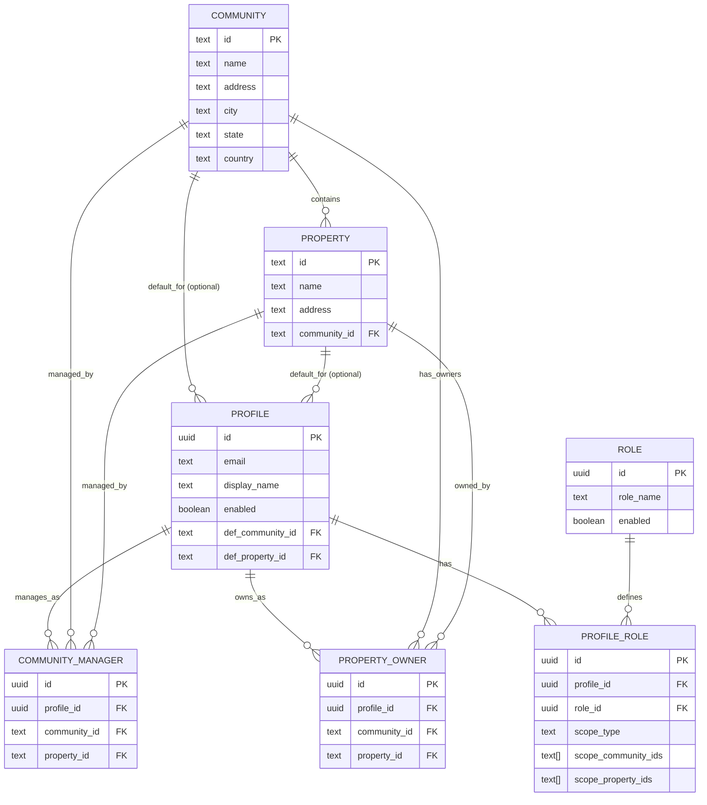
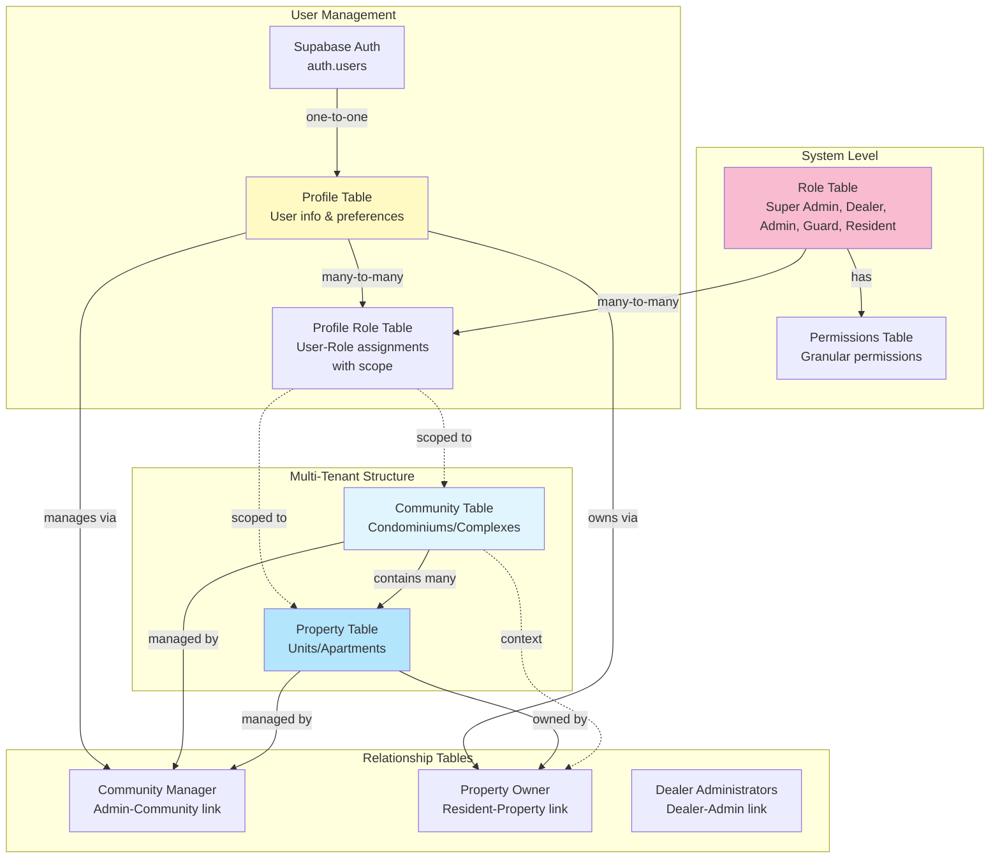
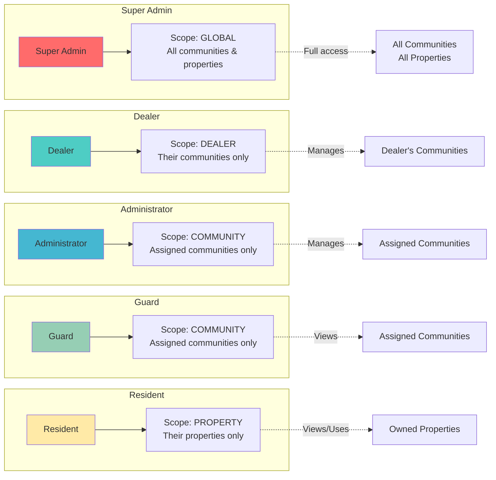
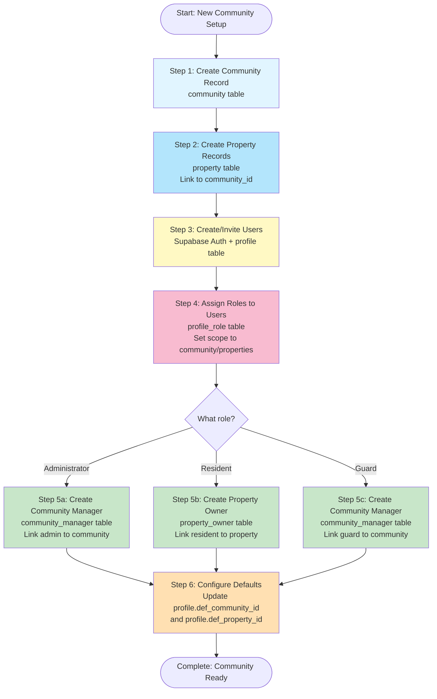

# Community, Users, and Property Management Guide

This guide explains the database design and relationships between Communities, Users (Profiles), and Properties in the PortunCmd system.

## Table of Contents

1. [Overview](#overview)
2. [Core Entities](#core-entities)
3. [Entity Relationships](#entity-relationships)
4. [Database Schema Diagrams](#database-schema-diagrams)
5. [Creation Workflows](#creation-workflows)
6. [Common Scenarios](#common-scenarios)
7. [Best Practices](#best-practices)

---

## Overview

PortunCmd uses a **multi-tenant architecture** where:
- **Communities** are the top-level organizational units (condominiums, gated communities, apartment complexes)
- **Properties** are individual units within a community (apartments, houses, lots)
- **Users (Profiles)** are people who interact with the system in various roles
- **Relationships** define who can access what and in what capacity

### Key Concepts

| Concept | Description | Example |
|---------|-------------|---------|
| **Community** | A physical location containing multiple properties | "Sunset Gardens Condominium", "Oak Park Estates" |
| **Property** | An individual unit within a community | "Apartment 501", "House #23", "Lot A-15" |
| **Profile** | A user account with contact info and preferences | "John Doe (john@email.com)" |
| **Role** | A permission level assigned to users | Super Admin, Mega Dealer, Dealer, Administrator, Guard, Client, Resident |
| **Assignment** | Linking users to communities/properties with specific roles | "Jane is Administrator of Sunset Gardens" |

---

## Core Entities

### 1. Community (`community` table)

Communities are the top-level containers in the system.

```
┌─────────────────────────────────────┐
│         COMMUNITY                   │
├─────────────────────────────────────┤
│ id (text, PK)                       │  ← Unique identifier
│ name                                │  ← "Sunset Gardens"
│ address, city, state, postal_code   │  ← Location details
│ country                             │
│ geolocation                         │  ← GPS coordinates
│ googlemaps                          │  ← Google Maps link
│ created_at, updated_at              │
└─────────────────────────────────────┘
```

**Purpose**: Represents a physical location (condominium, gated community) containing multiple properties.

**Examples**:
- "Sunset Gardens Condominium" - 200-unit apartment complex
- "Oak Park Estates" - Gated community with 50 houses
- "Downtown Towers" - High-rise building with condos

### 2. Property (`property` table)

Properties are individual units within a community.

```
┌─────────────────────────────────────┐
│         PROPERTY                    │
├─────────────────────────────────────┤
│ id (text, PK)                       │  ← Unique identifier
│ name                                │  ← "Apartment 501", "House #23"
│ address                             │  ← Unit-specific address
│ community_id (FK → community)       │  ← Belongs to which community
│ created_at, updated_at              │
└─────────────────────────────────────┘
```

**Purpose**: Represents a single dwelling/unit within a community.

**Examples**:
- "Apartment 501" in Sunset Gardens
- "House #23" in Oak Park Estates
- "Lot A-15" in Downtown Towers

**Key Rule**: Every property MUST belong to exactly one community.

### 3. Profile (`profile` table)

Profiles represent users in the system.

```
┌─────────────────────────────────────┐
│         PROFILE                     │
├─────────────────────────────────────┤
│ id (uuid, PK)                       │  ← Links to auth.users
│ email                               │  ← Login email
│ display_name                        │  ← "John Doe"
│ enabled                             │  ← Account active?
│ language                            │  ← Preferred language (en/es/pt)
│ def_community_id (FK → community)   │  ← Default community
│ def_property_id (FK → property)     │  ← Default property
│ created_at, updated_at              │
└─────────────────────────────────────┘
```

**Purpose**: Stores user account information and preferences.

**Key Features**:
- `enabled`: Must be `true` for user to log in
- `def_community_id` and `def_property_id`: Optional defaults for convenience
- Links to Supabase authentication (`auth.users`)

### 4. Role (`role` table)

Defines available permission levels in the system.

```
┌─────────────────────────────────────┐
│         ROLE                        │
├─────────────────────────────────────┤
│ id (uuid, PK)                       │
│ role_name                           │  ← "Super Admin", "Resident", etc.
│ enabled                             │  ← Role active?
│ created_at, updated_at              │
└─────────────────────────────────────┘
```

**Default Roles**:
1. **Super Admin** - Full system access (global scope)
2. **Dealer** - Manages multiple communities and their administrators
3. **Administrator** - Manages specific communities (can manage properties, residents, visitors)
4. **Guard** - Security personnel (can view visitors, control gates)
5. **Resident** - Property owner/tenant (can create visitor passes)

---

## Entity Relationships

### Core Relationship Diagram



### Key Relationships Explained

#### 1. Community ↔ Property (One-to-Many)
```
COMMUNITY (1) ────── contains ────── (Many) PROPERTY
```
- One community can have many properties
- Each property belongs to exactly one community
- Enforced by foreign key: `property.community_id → community.id`

**Example**:
```
Sunset Gardens Community
  ├── Apartment 101
  ├── Apartment 102
  ├── Apartment 201
  └── Apartment 202
```

#### 2. Profile ↔ Role (Many-to-Many via `profile_role`)
```
PROFILE (Many) ────── profile_role ────── (Many) ROLE
```
- Users can have multiple roles
- Roles can be assigned to multiple users
- Each assignment can be scoped to specific communities/properties

**Example**:
```
John Doe
  ├── Role: Administrator (scope: Sunset Gardens)
  └── Role: Resident (scope: Apartment 501)
```

#### 3. Profile ↔ Community (via `community_manager`)
```
PROFILE (Many) ────── community_manager ────── (Many) COMMUNITY
```
- Administrators can manage multiple communities
- Communities can have multiple managers
- Junction table tracks the management relationship

**Example**:
```
Jane Smith (Administrator)
  ├── Manages: Sunset Gardens
  └── Manages: Oak Park Estates
```

#### 4. Profile ↔ Property (via `property_owner`)
```
PROFILE (Many) ────── property_owner ────── (Many) PROPERTY
```
- Residents can own/rent multiple properties
- Properties can have multiple owners (co-ownership)
- Junction table tracks ownership

**Example**:
```
Bob Johnson (Resident)
  ├── Owns: Apartment 501
  └── Owns: Parking Space #12
```

---

## Database Schema Diagrams

### Full Multi-Tenant Architecture



### Scope-Based Access Control



---

## Creation Workflows

### Workflow 1: Creating a New Community with Properties and Users

This is the **recommended order** for setting up a new community.



### Detailed Step-by-Step Process

#### Step 1: Create Community

**Table**: `community`

```sql
INSERT INTO community (
  id,
  name,
  address,
  city,
  state,
  postal_code,
  country,
  geolocation,
  googlemaps
) VALUES (
  'sunset-gardens',
  'Sunset Gardens Condominium',
  '123 Main Street',
  'Miami',
  'Florida',
  '33101',
  'USA',
  '25.7617,-80.1918',
  'https://goo.gl/maps/example'
);
```

**Key Points**:
- Choose a unique, URL-friendly `id` (e.g., "sunset-gardens", "oak-park-estates")
- Fill in complete location information for accurate mapping
- `geolocation` format: "latitude,longitude"

#### Step 2: Create Properties

**Table**: `property`

```sql
-- Create multiple properties in the community
INSERT INTO property (id, name, address, community_id) VALUES
  ('sunset-gardens-apt-101', 'Apartment 101', 'Building A, Floor 1', 'sunset-gardens'),
  ('sunset-gardens-apt-102', 'Apartment 102', 'Building A, Floor 1', 'sunset-gardens'),
  ('sunset-gardens-apt-201', 'Apartment 201', 'Building A, Floor 2', 'sunset-gardens'),
  ('sunset-gardens-apt-202', 'Apartment 202', 'Building A, Floor 2', 'sunset-gardens');
```

**Key Points**:
- Each property `id` should be unique across the entire system
- Convention: Include community name in property ID for clarity
- `community_id` MUST match an existing community
- `address` can be unit-specific (building, floor, wing)

#### Step 3: Create User Profiles

**Tables**: `auth.users` (via Supabase Auth) → `profile`

**Option A: Invite users via Supabase Auth**
```typescript
// Using Supabase Admin API
const { data, error } = await supabase.auth.admin.inviteUserByEmail(
  'resident@example.com'
)
```

**Option B: Create profile after user signs up**
```sql
-- Profile is auto-created by trigger when user signs up
-- Or manually insert if needed:
INSERT INTO profile (
  id,
  email,
  display_name,
  enabled,
  language
) VALUES (
  'user-uuid-from-auth',
  'resident@example.com',
  'John Doe',
  true,
  'en'
);
```

**Key Points**:
- `profile.id` MUST match `auth.users.id` (UUID)
- Set `enabled = true` to allow login
- Leave `def_community_id` and `def_property_id` NULL initially (set later)

#### Step 4: Assign Roles to Users

**Table**: `profile_role`

**Example: Assign Administrator role scoped to Sunset Gardens**
```sql
INSERT INTO profile_role (
  profile_id,
  role_id,
  scope_type,
  scope_community_ids
) VALUES (
  'admin-user-uuid',
  (SELECT id FROM role WHERE role_name = 'Administrator'),
  'community',
  ARRAY['sunset-gardens']
);
```

**Example: Assign Resident role scoped to specific property**
```sql
INSERT INTO profile_role (
  profile_id,
  role_id,
  scope_type,
  scope_property_ids
) VALUES (
  'resident-user-uuid',
  (SELECT id FROM role WHERE role_name = 'Resident'),
  'property',
  ARRAY['sunset-gardens-apt-101']
);
```

**Scope Types**:
- `global`: Full system access (Super Admin only)
- `dealer`: Access to dealer's communities (Dealer role)
- `community`: Access to specific communities (Administrator, Guard)
- `property`: Access to specific properties (Resident)

#### Step 5a: Link Administrator to Community

**Table**: `community_manager`

```sql
INSERT INTO community_manager (
  profile_id,
  community_id,
  property_id
) VALUES (
  'admin-user-uuid',
  'sunset-gardens',
  NULL  -- Admins manage whole community, not specific property
);
```

**Key Points**:
- `property_id` is usually NULL for administrators (they manage the whole community)
- Same admin can manage multiple communities (multiple rows)

#### Step 5b: Link Resident to Property

**Table**: `property_owner`

```sql
INSERT INTO property_owner (
  profile_id,
  property_id,
  community_id
) VALUES (
  'resident-user-uuid',
  'sunset-gardens-apt-101',
  'sunset-gardens'
);
```

**Key Points**:
- Both `property_id` and `community_id` should be set
- Multiple residents can own same property (co-ownership)
- Same resident can own multiple properties

#### Step 6: Set Default Community/Property (Optional)

**Table**: `profile`

```sql
-- Set defaults for convenience
UPDATE profile
SET
  def_community_id = 'sunset-gardens',
  def_property_id = 'sunset-gardens-apt-101'
WHERE id = 'resident-user-uuid';
```

**Key Points**:
- These are convenience defaults only
- Not required for system functionality
- Used by UI to pre-select community/property in forms

---

## Common Scenarios

### Scenario 1: Adding a New Resident to Existing Community

**Given**:
- Community "Sunset Gardens" already exists
- Property "Apartment 301" already exists
- New user needs access as Resident

**Steps**:
1. Create user in Supabase Auth (or have them sign up)
2. Ensure `profile` record exists with `enabled = true`
3. Assign Resident role:
   ```sql
   INSERT INTO profile_role (profile_id, role_id, scope_type, scope_property_ids)
   VALUES (
     'new-user-uuid',
     (SELECT id FROM role WHERE role_name = 'Resident'),
     'property',
     ARRAY['sunset-gardens-apt-301']
   );
   ```
4. Link resident to property:
   ```sql
   INSERT INTO property_owner (profile_id, property_id, community_id)
   VALUES ('new-user-uuid', 'sunset-gardens-apt-301', 'sunset-gardens');
   ```
5. Set defaults:
   ```sql
   UPDATE profile
   SET def_community_id = 'sunset-gardens', def_property_id = 'sunset-gardens-apt-301'
   WHERE id = 'new-user-uuid';
   ```

**Result**: User can now log in as Resident of Apartment 301

### Scenario 2: Promoting Resident to Administrator

**Given**:
- User is currently a Resident
- Need to make them an Administrator of the same community

**Steps**:
1. Add Administrator role (keep existing Resident role):
   ```sql
   INSERT INTO profile_role (profile_id, role_id, scope_type, scope_community_ids)
   VALUES (
     'user-uuid',
     (SELECT id FROM role WHERE role_name = 'Administrator'),
     'community',
     ARRAY['sunset-gardens']
   );
   ```
2. Add community manager record:
   ```sql
   INSERT INTO community_manager (profile_id, community_id, property_id)
   VALUES ('user-uuid', 'sunset-gardens', NULL);
   ```

**Result**: User now has both Resident AND Administrator roles
- Can manage the entire community as Administrator
- Can create visitor passes as Resident for their property

### Scenario 3: Adding Properties to Existing Community

**Given**:
- Community exists
- Need to add new building with 10 units

**Steps**:
1. Bulk insert properties:
   ```sql
   INSERT INTO property (id, name, address, community_id)
   SELECT
     'sunset-gardens-bldg-b-apt-' || unit_num,
     'Building B - Apartment ' || unit_num,
     'Building B, Floor ' || CEIL(unit_num::numeric / 2),
     'sunset-gardens'
   FROM generate_series(101, 110) AS unit_num;
   ```

**Result**: 10 new properties created, ready for resident assignment

### Scenario 4: Dealer Managing Multiple Communities

**Given**:
- Dealer needs to oversee 3 communities
- Each community has its own administrators

**Steps**:
1. Assign Dealer role with global or dealer scope:
   ```sql
   INSERT INTO profile_role (profile_id, role_id, scope_type)
   VALUES (
     'dealer-uuid',
     (SELECT id FROM role WHERE role_name = 'Dealer'),
     'dealer'
   );
   ```
2. Create administrators for each community
3. Link administrators to dealer:
   ```sql
   INSERT INTO dealer_administrators (
     dealer_id,
     administrator_id,
     assigned_community_ids
   ) VALUES
     ('dealer-uuid', 'admin1-uuid', ARRAY['community-a']),
     ('dealer-uuid', 'admin2-uuid', ARRAY['community-b']),
     ('dealer-uuid', 'admin3-uuid', ARRAY['community-c']);
   ```

**Result**: Dealer can view all 3 communities and their administrators

---

## Best Practices

### 1. Community Setup

✅ **DO**:
- Use URL-friendly IDs for communities (lowercase, hyphens)
- Fill in complete address information
- Provide accurate geolocation coordinates
- Use descriptive, user-friendly names

❌ **DON'T**:
- Use spaces or special characters in community IDs
- Leave address fields blank
- Create duplicate community records

### 2. Property Management

✅ **DO**:
- Include community name in property ID for clarity
- Use consistent naming conventions (e.g., "Building X - Unit Y")
- Always link properties to valid communities
- Use meaningful property names

❌ **DON'T**:
- Create properties without a community
- Reuse property IDs
- Use ambiguous property names

### 3. User Assignment

✅ **DO**:
- Always set `profile.enabled = true` for active users
- Assign appropriate roles based on user function
- Use scope restrictions to limit access
- Set default community/property for better UX
- Document role assignments in `notes` field

❌ **DON'T**:
- Give users more permissions than needed
- Create profiles without email addresses
- Assign roles without proper scope
- Forget to create relationship records (community_manager, property_owner)

### 4. Role Assignment Order

**Recommended order**:
1. Create/verify user profile exists
2. Assign role in `profile_role` with appropriate scope
3. Create relationship record (`community_manager` or `property_owner`)
4. Set default community/property in profile
5. Verify user can log in and see correct data

### 5. Data Integrity

✅ **DO**:
- Use transactions when creating related records
- Verify foreign key references exist before inserting
- Clean up orphaned records periodically
- Use database constraints to enforce rules

❌ **DON'T**:
- Delete communities/properties with existing users
- Delete users without cleaning up relationships
- Manually modify `auth.users` table

### 6. Scope Management

**Scope hierarchy (from broadest to narrowest)**:
1. `global` - Entire system (Super Admin)
2. `dealer` - Multiple communities (Dealer)
3. `community` - Single or multiple communities (Administrator, Guard)
4. `property` - Single or multiple properties (Resident)

**Rules**:
- Lower-level scopes cannot access higher-level data
- Always use the most restrictive scope that meets requirements
- Guards should only have `community` scope (read-only for most operations)
- Residents should only have `property` scope

### 7. Testing Checklist

Before deploying a new community setup:

- [ ] Community record created with complete information
- [ ] All properties created and linked to community
- [ ] Test user profiles created with `enabled = true`
- [ ] Roles assigned with correct scope
- [ ] Relationship tables populated (community_manager, property_owner)
- [ ] Default community/property set for users
- [ ] Test login as each role type
- [ ] Verify RLS policies work correctly
- [ ] Check that users only see their scoped data

---

## Summary

The PortunCmd database design uses a **hierarchical multi-tenant architecture**:

1. **Communities** are top-level containers
2. **Properties** belong to communities (one-to-many)
3. **Users (Profiles)** have roles with scope-based access
4. **Relationships** link users to communities/properties

**Key Tables**:
- `community` - Top-level organizational units
- `property` - Individual units within communities
- `profile` - User accounts
- `role` - Permission levels
- `profile_role` - User-role assignments with scope
- `community_manager` - Admin/Guard assignments to communities
- `property_owner` - Resident assignments to properties

**Creation Order**:
1. Community → 2. Properties → 3. Users → 4. Roles → 5. Relationships → 6. Defaults

For more details, see:
- [SUPABASE_SCHEMA.md](./SUPABASE_SCHEMA.md) - Complete database schema reference
- [RBAC_GUIDE.md](./RBAC_GUIDE.md) - Role-based access control details
- [AUTHENTICATION.md](./AUTHENTICATION.md) - User management and authentication
