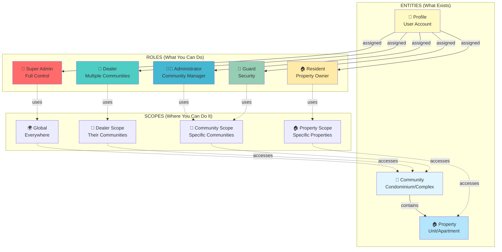

# Complete Database Design Guide - Executive Summary

This document provides a high-level overview of the entire PortunCmd database design, tying together all concepts.

## 🎯 The Big Picture

PortunCmd uses a **multi-tenant, scope-based access control system** for property management.

### Three Core Concepts

```
1. ENTITIES (What exists?)
   └─ Communities, Properties, Users

2. ROLES (What can you do?)
   └─ Super Admin, Mega Dealer, Dealer, Administrator, Guard, Client, Resident

3. SCOPES (Where can you do it?)
   └─ Global, Dealer, Community, Property
```

---

## 📊 Complete System Architecture



---

## 🗄️ Database Tables Overview

### Core Tables (9)

| Table | Purpose | Key Fields | Related To |
|-------|---------|-----------|------------|
| **community** | Locations/complexes | id, name, address | ← Properties |
| **property** | Units/apartments | id, name, community_id | ← Owners |
| **profile** | User accounts | id, email, enabled | ← Roles, Relationships |
| **role** | Permission levels | id, role_name | ← Users via profile_role |
| **profile_role** | User→Role + **SCOPE** | scope_type, scope_*_ids | Core authorization |
| **community_manager** | Admin/Guard → Community | profile_id, community_id | Links managers |
| **property_owner** | Resident → Property | profile_id, property_id | Links residents |
| **permissions** | Granular permissions | name, resource, action | ← Roles |
| **role_permissions** | Role → Permission mapping | role_id, permission_id | RBAC system |

### Relationship Tables (3)

| Table | Links | Purpose |
|-------|-------|---------|
| **dealer_administrators** | Dealer ↔ Administrators | Dealer portfolio management |
| **community_manager** | Admin/Guard ↔ Community | Management assignments |
| **property_owner** | Resident ↔ Property | Ownership/tenancy |

### Feature Tables (4)

| Table | Purpose |
|-------|---------|
| **visitor_records_uid** | Visitor passes with QR codes |
| **visitor_record_logs** | Entry/exit logs |
| **automation_devices** | IoT gate control (Shelly) |
| **notifications** | Push notifications |

---

## 🔑 The Authorization Chain

### How Access Control Works

```
┌─────────────────────────────────────────────────────────────┐
│ 1. USER LOGS IN                                             │
│    ↓                                                         │
│    Supabase Auth validates credentials                      │
└─────────────────────────────────────────────────────────────┘
                              ↓
┌─────────────────────────────────────────────────────────────┐
│ 2. FETCH USER PROFILE                                       │
│    ↓                                                         │
│    profile table → Check enabled = true                     │
└─────────────────────────────────────────────────────────────┘
                              ↓
┌─────────────────────────────────────────────────────────────┐
│ 3. GET ROLES & SCOPES                                       │
│    ↓                                                         │
│    profile_role table → role_id + scope_type + scope_*_ids  │
└─────────────────────────────────────────────────────────────┘
                              ↓
┌─────────────────────────────────────────────────────────────┐
│ 4. GENERATE CASL ABILITIES                                  │
│    ↓                                                         │
│    Convert roles to CASL rules (frontend authorization)     │
└─────────────────────────────────────────────────────────────┘
                              ↓
┌─────────────────────────────────────────────────────────────┐
│ 5. USER TRIES TO ACCESS DATA                                │
│    ↓                                                         │
│    RLS policies check scope → Filter results                │
└─────────────────────────────────────────────────────────────┘
                              ↓
┌─────────────────────────────────────────────────────────────┐
│ 6. RETURN SCOPED DATA                                       │
│    ↓                                                         │
│    User sees only what their scope allows                   │
└─────────────────────────────────────────────────────────────┘
```

---

## 🔒 The 4 Scopes Explained Simply

### Visual Comparison

```
┌────────────────────────────────────────────────────────────┐
│ SCOPE 1: GLOBAL (Super Admin)                             │
├────────────────────────────────────────────────────────────┤
│ 🌍 Can access:                                             │
│    ✅ ALL communities                                      │
│    ✅ ALL properties                                       │
│    ✅ ALL users                                            │
│    ✅ System configuration                                 │
└────────────────────────────────────────────────────────────┘

┌────────────────────────────────────────────────────────────┐
│ SCOPE 2: DEALER (Dealer)                                   │
├────────────────────────────────────────────────────────────┤
│ 🏪 Can access:                                             │
│    ✅ Communities they manage                              │
│    ✅ Their administrators                                 │
│    ✅ Properties in their communities                      │
│    ✅ Residents in their communities                       │
│    ❌ Other dealers' communities                           │
└────────────────────────────────────────────────────────────┘

┌────────────────────────────────────────────────────────────┐
│ SCOPE 3: COMMUNITY (Administrator, Guard)                  │
├────────────────────────────────────────────────────────────┤
│ 🏢 Can access:                                             │
│    ✅ Assigned community/communities                       │
│    ✅ All properties in those communities                  │
│    ✅ All residents in those communities                   │
│    ❌ Other communities                                    │
│                                                             │
│ Administrator: Full management                             │
│ Guard: Read-only + gate control                            │
└────────────────────────────────────────────────────────────┘

┌────────────────────────────────────────────────────────────┐
│ SCOPE 4: PROPERTY (Resident)                               │
├────────────────────────────────────────────────────────────┤
│ 🏠 Can access:                                             │
│    ✅ Their own property/properties                        │
│    ✅ Create visitors for their properties                 │
│    ✅ View their community (context only)                  │
│    ❌ Other properties                                     │
│    ❌ Other residents                                      │
└────────────────────────────────────────────────────────────┘
```

---

## 📋 Step-by-Step: Creating Everything

### Complete Setup Flow

```
STEP 1: Create Community
    ↓
    INSERT INTO community (id, name, address, ...)
    VALUES ('sunset-gardens', 'Sunset Gardens', ...);

STEP 2: Create Properties
    ↓
    INSERT INTO property (id, name, community_id)
    VALUES
      ('apt-101', 'Apartment 101', 'sunset-gardens'),
      ('apt-102', 'Apartment 102', 'sunset-gardens'),
      ...;

STEP 3: Create User Accounts
    ↓
    Supabase Auth → profile table
    (enabled = true)

STEP 4: Assign Roles with Scopes
    ↓
    INSERT INTO profile_role (profile_id, role_id, scope_type, scope_*_ids)
    VALUES
      -- Administrator
      ('admin-uuid', 'admin-role', 'community', ARRAY['sunset-gardens']),
      -- Resident
      ('resident-uuid', 'resident-role', 'property', ARRAY['apt-101']);

STEP 5: Create Relationships
    ↓
    INSERT INTO community_manager (profile_id, community_id)
    VALUES ('admin-uuid', 'sunset-gardens');

    INSERT INTO property_owner (profile_id, property_id, community_id)
    VALUES ('resident-uuid', 'apt-101', 'sunset-gardens');

STEP 6: Set Defaults (Optional)
    ↓
    UPDATE profile
    SET def_community_id = 'sunset-gardens', def_property_id = 'apt-101'
    WHERE id = 'resident-uuid';

DONE ✅
```

---

## 🎭 Real-World Scenario

### Sunset Gardens Condominium Setup

**The Setup**:
- 1 Community: "Sunset Gardens"
- 20 Properties: Apartments 101-120
- 5 Users:
  - 1 Administrator (Jane)
  - 1 Guard (Mike)
  - 3 Residents (John, Mary, Bob)

**The Database Records**:

```sql
-- 1. Community
INSERT INTO community (id, name) VALUES ('sunset-gardens', 'Sunset Gardens');

-- 2. Properties (20 apartments)
INSERT INTO property (id, name, community_id)
SELECT
  'apt-' || num,
  'Apartment ' || num,
  'sunset-gardens'
FROM generate_series(101, 120) num;

-- 3. Profiles (assume already created via Supabase Auth)

-- 4. Roles with Scopes
-- Administrator Jane
INSERT INTO profile_role (profile_id, role_id, scope_type, scope_community_ids)
VALUES ('jane-uuid', 'admin-role', 'community', ARRAY['sunset-gardens']);

-- Guard Mike
INSERT INTO profile_role (profile_id, role_id, scope_type, scope_community_ids)
VALUES ('mike-uuid', 'guard-role', 'community', ARRAY['sunset-gardens']);

-- Resident John (Apt 101)
INSERT INTO profile_role (profile_id, role_id, scope_type, scope_property_ids)
VALUES ('john-uuid', 'resident-role', 'property', ARRAY['apt-101']);

-- Resident Mary (Apt 102)
INSERT INTO profile_role (profile_id, role_id, scope_type, scope_property_ids)
VALUES ('mary-uuid', 'resident-role', 'property', ARRAY['apt-102']);

-- Resident Bob (Apt 103)
INSERT INTO profile_role (profile_id, role_id, scope_type, scope_property_ids)
VALUES ('bob-uuid', 'resident-role', 'property', ARRAY['apt-103']);

-- 5. Relationships
INSERT INTO community_manager (profile_id, community_id)
VALUES
  ('jane-uuid', 'sunset-gardens'),  -- Administrator
  ('mike-uuid', 'sunset-gardens');  -- Guard

INSERT INTO property_owner (profile_id, property_id, community_id)
VALUES
  ('john-uuid', 'apt-101', 'sunset-gardens'),
  ('mary-uuid', 'apt-102', 'sunset-gardens'),
  ('bob-uuid', 'apt-103', 'sunset-gardens');
```

**What Each User Can Do**:

| User | Role | Scope | Can Access |
|------|------|-------|------------|
| Jane | Administrator | Community: [sunset-gardens] | All 20 apartments, all 3 residents, create/manage properties |
| Mike | Guard | Community: [sunset-gardens] | View all apartments, view residents, control gates, manage visitors |
| John | Resident | Property: [apt-101] | Only Apt 101, create visitors for Apt 101 |
| Mary | Resident | Property: [apt-102] | Only Apt 102, create visitors for Apt 102 |
| Bob | Resident | Property: [apt-103] | Only Apt 103, create visitors for Apt 103 |

---

## 🔍 Quick Reference Tables

### Table 1: Scope Summary

| Scope Type | Who Uses It | Database Field | Stores |
|------------|-------------|----------------|--------|
| `global` | Super Admin | None needed | Nothing (unlimited) |
| `dealer` | Dealer | `scope_dealer_id` | Self-reference UUID |
| `community` | Admin, Guard | `scope_community_ids` | Array of community IDs |
| `property` | Resident | `scope_property_ids` | Array of property IDs |

### Table 2: Required Records by Role

| Role | profile_role | Relationship Table | Scope Type |
|------|--------------|-------------------|------------|
| Super Admin | ✅ Yes | ❌ None | global |
| Dealer | ✅ Yes | dealer_administrators | dealer |
| Administrator | ✅ Yes | community_manager | community |
| Guard | ✅ Yes | community_manager | community |
| Resident | ✅ Yes | property_owner | property |

### Table 3: Access Matrix

| Role | View Communities | Manage Properties | Create Visitors | Control Gates | System Config |
|------|------------------|------------------|-----------------|---------------|---------------|
| Super Admin | All | All | All | All | ✅ Yes |
| Dealer | Their portfolio | Via Admins | ❌ No | ❌ No | ❌ No |
| Administrator | Assigned | Assigned | Assigned | Assigned | ❌ No |
| Guard | Assigned | ❌ Read-only | View/Update | ✅ Yes | ❌ No |
| Resident | Context only | ❌ No | Own properties | ❌ No | ❌ No |

---

## 📚 Documentation Index

### Start Here
1. **[Database Visual Reference](./DATABASE_VISUAL_REFERENCE.md)** - Simple diagrams and quick reference
2. **[Community-User-Property Guide](./COMMUNITY_USER_PROPERTY_GUIDE.md)** - Core concepts explained

### Deep Dives
3. **[Scope System Guide](./SCOPE_SYSTEM_GUIDE.md)** - Complete scope reference with all 4 types
4. **[Data Model Workflows](./DATA_MODEL_WORKFLOWS.md)** - Practical workflows and SQL examples
5. **[RBAC Guide](./RBAC_GUIDE.md)** - Role-based access control system

### Technical Reference
6. **[Supabase Schema](./SUPABASE_SCHEMA.md)** - Complete database schema
7. **[Supabase Usage](./SUPABASE_USAGE.md)** - Code examples and patterns

---

## ✅ Understanding Checklist

Before building features, ensure you understand:

- [ ] **Entities**: What are Communities, Properties, and Profiles?
- [ ] **Relationships**: How do entities connect (via junction tables)?
- [ ] **Roles**: What are the 7 roles and what can each do?
- [ ] **Scopes**: What are the 4 scope types and how do they limit access?
- [ ] **profile_role**: How does this table combine role + scope?
- [ ] **RLS Policies**: How are scopes enforced in the database?
- [ ] **Creation Order**: Community → Properties → Users → Roles → Relationships
- [ ] **Multi-Role**: Users can have multiple roles with different scopes

---

## 🎯 Common Questions Answered

### Q: What's the difference between role and scope?

**A**:
- **Role** = WHAT you can do (permissions)
- **Scope** = WHERE you can do it (boundaries)

Example: "Administrator" role with "community: sunset-gardens" scope = Can administer Sunset Gardens only

### Q: Can a user have multiple roles?

**A**: Yes! A user can be both Administrator AND Resident. They'll have 2 rows in `profile_role` with different scopes.

### Q: Why do we need both profile_role and community_manager?

**A**:
- `profile_role` defines role + scope (authorization)
- `community_manager` links user to community (relationship/assignment)
- Both are needed: role for permissions, relationship for assignment

### Q: How do I add a new resident?

**A**: Follow these steps:
1. Create profile (or they sign up)
2. Add row to `profile_role` (role: Resident, scope: property, scope_property_ids: ['apt-101'])
3. Add row to `property_owner` (links resident to property)
4. Optionally set defaults in `profile`

### Q: What if a resident moves to a different apartment?

**A**:
1. Update `profile_role.scope_property_ids` (change apt-101 to apt-102)
2. Delete old `property_owner` record (apt-101)
3. Insert new `property_owner` record (apt-102)
4. Update `profile` defaults

### Q: Can an administrator manage multiple communities?

**A**: Yes! Set `scope_community_ids = ARRAY['community-a', 'community-b', 'community-c']` and create `community_manager` records for each.

---

## 🚀 Next Steps

1. **Read the guides** in order (Visual → Community-User-Property → Scope)
2. **Try the SQL examples** in the Data Model Workflows guide
3. **Understand RLS policies** in the Scope System Guide
4. **Build features** using the patterns documented

---

## 📞 Need Help?

Refer to these guides based on your question:

| Question About | Read This Guide |
|----------------|-----------------|
| "How do Communities/Properties work?" | [Community-User-Property Guide](./COMMUNITY_USER_PROPERTY_GUIDE.md) |
| "What are scopes?" | [Scope System Guide](./SCOPE_SYSTEM_GUIDE.md) |
| "How do I create/query data?" | [Data Model Workflows](./DATA_MODEL_WORKFLOWS.md) |
| "Quick visual reference?" | [Database Visual Reference](./DATABASE_VISUAL_REFERENCE.md) |
| "Complete schema reference?" | [Supabase Schema](./SUPABASE_SCHEMA.md) |
| "How does RBAC work?" | [RBAC Guide](./RBAC_GUIDE.md) |

---

**You now have a complete understanding of the PortunCmd database design!** 🎉
