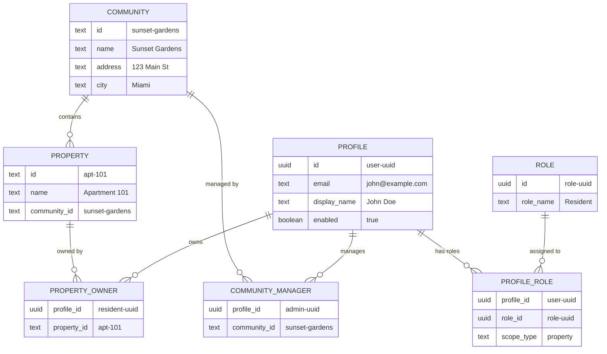

# Database Visual Reference Guide

Quick visual reference for understanding the PortunCmd database structure.

## Table of Contents

1. [The Big Picture](#the-big-picture)
2. [Entity Relationship Diagrams](#entity-relationship-diagrams)
3. [Table Relationships](#table-relationships)
4. [Quick Examples](#quick-examples)
5. [Visual Glossary](#visual-glossary)

---

## The Big Picture

### How Everything Connects

```
┌─────────────────────────────────────────────────────────────────┐
│                        PORTUNCMD SYSTEM                         │
└─────────────────────────────────────────────────────────────────┘
                              │
                    ┌─────────┴─────────┐
                    │                   │
            ┌───────▼────────┐  ┌──────▼────────┐
            │  COMMUNITIES   │  │     USERS     │
            │  (Locations)   │  │   (People)    │
            └───────┬────────┘  └──────┬────────┘
                    │                   │
                    │     ┌─────────────┘
                    │     │
            ┌───────▼─────▼─────┐
            │    PROPERTIES      │
            │   (Units/Homes)    │
            └────────────────────┘
```

### Simple Hierarchy

```
🏢 Community: "Sunset Gardens"
   │
   ├── 🏠 Property: "Apartment 101"
   │   └── 👤 Owner: John Doe (Resident)
   │
   ├── 🏠 Property: "Apartment 102"
   │   └── 👤 Owner: Mary Smith (Resident)
   │
   ├── 🏠 Property: "Apartment 201"
   │   └── 👤 Owner: Bob Wilson (Resident)
   │
   ├── 👨‍💼 Manager: Jane Admin (Administrator)
   │
   └── 💂 Security: Mike Guard (Guard)
```

---

## Entity Relationship Diagrams

### Core Tables and Their Connections



### Simplified Connection Map

```
┌──────────────┐
│  COMMUNITY   │──────────┐
│  (Location)  │          │
└──────┬───────┘          │
       │                  │
       │ has many         │
       │                  │
       ▼                  │ belongs to
┌──────────────┐          │
│   PROPERTY   │──────────┘
│    (Unit)    │
└──────┬───────┘
       │
       │ owned by
       │
       ▼
┌──────────────┐      ┌──────────────┐
│PROPERTY_OWNER│◄─────┤   PROFILE    │
│  (Junction)  │      │    (User)    │
└──────────────┘      └──────┬───────┘
                             │
                             │ has
                             │
                             ▼
                      ┌──────────────┐      ┌──────────────┐
                      │PROFILE_ROLE  │◄─────┤     ROLE     │
                      │  (Junction)  │      │ (Permission) │
                      └──────────────┘      └──────────────┘
```

---

## Table Relationships

### 1. Community → Property (Parent-Child)

```
╔════════════════════╗
║    COMMUNITY       ║
║ id: sunset-gardens ║
╚═════════╦══════════╝
          ║ One community has many properties
          ║
          ╠═══════════════════════════════════╗
          ║                                   ║
╔═════════╩══════════╗            ╔═════════╩══════════╗
║     PROPERTY       ║            ║     PROPERTY       ║
║ id: apt-101        ║            ║ id: apt-102        ║
║ community_id:      ║            ║ community_id:      ║
║   sunset-gardens   ║            ║   sunset-gardens   ║
╚════════════════════╝            ╚════════════════════╝
```

**Rule**: Every property MUST have a community. A community can have 0 or more properties.

### 2. Profile → Role (Many-to-Many via profile_role)

```
╔═══════════════════╗                    ╔═══════════════════╗
║     PROFILE       ║                    ║       ROLE        ║
║ John Doe          ║                    ║ Resident          ║
╚═════════╦═════════╝                    ╚═════════╦═════════╝
          ║                                        ║
          ║                                        ║
          ║         ╔══════════════════╗           ║
          ╚════════►║  PROFILE_ROLE    ║◄══════════╝
                    ║  Links users     ║
                    ║  to roles        ║
                    ║  + scope info    ║
                    ╚══════════════════╝
```

**Key Point**: `profile_role` doesn't just link users to roles - it also defines SCOPE (which communities/properties they can access).

### 3. Profile → Community (Many-to-Many via community_manager)

```
╔═══════════════════╗                    ╔═══════════════════╗
║     PROFILE       ║                    ║    COMMUNITY      ║
║ Jane Admin        ║                    ║ Sunset Gardens    ║
╚═════════╦═════════╝                    ╚═════════╦═════════╝
          ║                                        ║
          ║                                        ║
          ║       ╔════════════════════╗           ║
          ╚══════►║ COMMUNITY_MANAGER  ║◄══════════╝
                  ║ Links admins/guards║
                  ║ to communities     ║
                  ╚════════════════════╝
```

**Use Case**: Administrators and Guards are linked to communities via this table.

### 4. Profile → Property (Many-to-Many via property_owner)

```
╔═══════════════════╗                    ╔═══════════════════╗
║     PROFILE       ║                    ║     PROPERTY      ║
║ Bob Resident      ║                    ║ Apartment 101     ║
╚═════════╦═════════╝                    ╚═════════╦═════════╝
          ║                                        ║
          ║                                        ║
          ║        ╔═══════════════════╗           ║
          ╚═══════►║  PROPERTY_OWNER   ║◄══════════╝
                   ║ Links residents   ║
                   ║ to properties     ║
                   ╚═══════════════════╝
```

**Use Case**: Residents are linked to properties they own/rent via this table.

---

## Quick Examples

### Example 1: Community with 3 Properties

```
╔═══════════════════════════════════════════════════════════╗
║               COMMUNITY: Sunset Gardens                   ║
╚═══════════════════════════════════════════════════════════╝
                            │
        ┌───────────────────┼───────────────────┐
        │                   │                   │
        ▼                   ▼                   ▼
   ┌─────────┐         ┌─────────┐        ┌─────────┐
   │ Apt 101 │         │ Apt 102 │        │ Apt 201 │
   └─────────┘         └─────────┘        └─────────┘
```

**Database Records**:

```sql
-- 1 community record
INSERT INTO community (id, name) VALUES ('sunset-gardens', 'Sunset Gardens');

-- 3 property records
INSERT INTO property (id, name, community_id) VALUES
  ('apt-101', 'Apartment 101', 'sunset-gardens'),
  ('apt-102', 'Apartment 102', 'sunset-gardens'),
  ('apt-201', 'Apartment 201', 'sunset-gardens');
```

### Example 2: User with Multiple Roles

```
              ╔════════════════════╗
              ║   USER: Jane       ║
              ╚═════════╦══════════╝
                        │
          ┌─────────────┴─────────────┐
          │                           │
          ▼                           ▼
    ┌──────────┐              ┌─────────────┐
    │   ROLE:  │              │    ROLE:    │
    │ Resident │              │Administrator│
    └────┬─────┘              └──────┬──────┘
         │                           │
         │ Scope: Property           │ Scope: Community
         │ Apt 101                   │ Sunset Gardens
         │                           │
         ▼                           ▼
   Can create                  Can manage all
   visitors for                residents &
   Apt 101                     properties in
                               Sunset Gardens
```

**Database Records**:

```sql
-- 2 role assignments
INSERT INTO profile_role (profile_id, role_id, scope_type, scope_property_ids) VALUES
  ('jane-uuid', (SELECT id FROM role WHERE role_name='Resident'), 'property', ARRAY['apt-101']);

INSERT INTO profile_role (profile_id, role_id, scope_type, scope_community_ids) VALUES
  ('jane-uuid', (SELECT id FROM role WHERE role_name='Administrator'), 'community', ARRAY['sunset-gardens']);

-- 2 relationship records
INSERT INTO property_owner (profile_id, property_id, community_id) VALUES
  ('jane-uuid', 'apt-101', 'sunset-gardens');

INSERT INTO community_manager (profile_id, community_id) VALUES
  ('jane-uuid', 'sunset-gardens');
```

### Example 3: Complete Community Setup

```
╔══════════════════════════════════════════════════════════════╗
║                  SUNSET GARDENS COMMUNITY                    ║
╚══════════════════════════════════════════════════════════════╝
                              │
    ┌─────────────────────────┼─────────────────────────┐
    │                         │                         │
    ▼                         ▼                         ▼
┌────────────┐          ┌──────────┐             ┌──────────┐
│ Apartment  │          │Apartment │             │Apartment │
│    101     │          │   102    │             │   201    │
└─────┬──────┘          └────┬─────┘             └────┬─────┘
      │                      │                        │
      │ Owner                │ Owner                  │ Owner
      ▼                      ▼                        ▼
┌──────────┐           ┌──────────┐            ┌──────────┐
│  John    │           │  Mary    │            │   Bob    │
│   Doe    │           │  Smith   │            │ Wilson   │
│(Resident)│           │(Resident)│            │(Resident)│
└──────────┘           └──────────┘            └──────────┘

    ┌──────────────────────────────────────┐
    │      Community Staff:                │
    │  👨‍💼 Jane Admin (Administrator)       │
    │  💂 Mike Guard (Guard)                │
    └──────────────────────────────────────┘
```

**What this creates**:
- 1 Community
- 3 Properties
- 5 Users (3 residents + 1 admin + 1 guard)
- 5 Role assignments
- 5 Relationship records (3 property_owner + 2 community_manager)

---

## Visual Glossary

### Table Icons

| Icon | Entity | Description |
|------|--------|-------------|
| 🏢 | Community | A location/building containing properties |
| 🏠 | Property | An individual unit/apartment/house |
| 👤 | Profile | A user account |
| 🎭 | Role | A permission level (Admin, Resident, etc.) |
| 🔗 | Junction Table | Connects two entities (many-to-many) |

### Role Icons

| Icon | Role | Access Level |
|------|------|-------------|
| 👑 | Super Admin | Full system access |
| 🏪 | Dealer | Multiple communities |
| 👨‍💼 | Administrator | Specific community/communities |
| 💂 | Guard | View community, control gates |
| 🏠 | Resident | Own property only |

### Relationship Symbols

```
──────►  One-to-Many (e.g., Community → Properties)
◄─────►  Many-to-Many (e.g., Users ↔ Roles)
╔═════╗  Table/Entity
│     │  Attribute/Field
┌─────┐  Instance/Record
```

### Scope Visualization

```
╔═════════════════════════════════════════════════════════════╗
║ GLOBAL SCOPE (Super Admin)                                 ║
║  ┌──────────────────────────────────────────────────────┐  ║
║  │ DEALER SCOPE (Dealer)                                │  ║
║  │  ┌────────────────────────────────────────────────┐  │  ║
║  │  │ COMMUNITY SCOPE (Administrator, Guard)         │  │  ║
║  │  │  ┌──────────────────────────────────────────┐  │  │  ║
║  │  │  │ PROPERTY SCOPE (Resident)                │  │  │  ║
║  │  │  │  Individual property access              │  │  │  ║
║  │  │  └──────────────────────────────────────────┘  │  │  ║
║  │  │  All properties in assigned communities        │  │  ║
║  │  └────────────────────────────────────────────────┘  │  ║
║  │  All communities under dealer                        │  ║
║  └──────────────────────────────────────────────────────┘  ║
║  All communities and properties in system                  ║
╚═════════════════════════════════════════════════════════════╝
```

---

## Common Patterns

### Pattern 1: Creating a Community

```
Step 1: Create Community
    ↓
Step 2: Create Properties
    ↓
Step 3: Create Admin
    ↓
Step 4: Link Admin to Community
    ↓
Step 5: Create Residents
    ↓
Step 6: Link Residents to Properties
```

### Pattern 2: Adding a Resident

```
Resident Account → Assign Resident Role → Link to Property → Set Defaults
```

### Pattern 3: User Access Flow

```
User Login
    ↓
Check Profile (enabled?)
    ↓
Get Roles from profile_role
    ↓
Get Scope (communities/properties)
    ↓
Load Accessible Data
    ↓
Display Dashboard
```

---

## Decision Tree: Which Table to Use?

### Adding a New User

```
What role will they have?
│
├── Super Admin
│   └── Just create profile + assign global role
│
├── Dealer
│   └── profile → profile_role (dealer scope)
│
├── Administrator
│   └── profile → profile_role (community scope) → community_manager
│
├── Guard
│   └── profile → profile_role (community scope) → community_manager
│
└── Resident
    └── profile → profile_role (property scope) → property_owner
```

### Querying Access

```
What can this user access?
│
├── Check profile_role.scope_type
│   │
│   ├── global → Everything
│   │
│   ├── dealer → scope_dealer_id communities
│   │
│   ├── community → scope_community_ids
│   │
│   └── property → scope_property_ids
│
└── Also check junction tables
    │
    ├── community_manager → communities they manage
    │
    └── property_owner → properties they own
```

---

## Summary: The 4 Core Tables

### 1. `community` - The Container
```
┌─────────────────────┐
│ id: sunset-gardens  │  ← Unique identifier
│ name: Sunset Gardens│  ← Display name
│ address: ...        │  ← Location
└─────────────────────┘
```
**Creates**: A location that contains properties

### 2. `property` - The Unit
```
┌─────────────────────────────────┐
│ id: apt-101                     │  ← Unique identifier
│ name: Apartment 101             │  ← Display name
│ community_id: sunset-gardens    │  ← Parent community
└─────────────────────────────────┘
```
**Creates**: A dwelling within a community

### 3. `profile` - The User
```
┌─────────────────────────────────┐
│ id: user-uuid                   │  ← Links to auth
│ email: john@example.com         │  ← Login email
│ display_name: John Doe          │  ← Display name
│ enabled: true                   │  ← Can log in?
└─────────────────────────────────┘
```
**Creates**: A user account

### 4. `profile_role` - The Permission
```
┌─────────────────────────────────────┐
│ profile_id: user-uuid               │  ← Which user
│ role_id: resident-role-uuid         │  ← Which role
│ scope_type: property                │  ← Access level
│ scope_property_ids: [apt-101]       │  ← What they can access
└─────────────────────────────────────┘
```
**Creates**: A permission assignment with scope

### Junction Tables (Connect Things Together)

```
community_manager    →  Links Admins/Guards to Communities
property_owner       →  Links Residents to Properties
dealer_administrators → Links Dealers to Administrators
```

---

## Quick Start Checklist

Setting up a new community? Follow this order:

- [ ] **Step 1**: Create `community` record
- [ ] **Step 2**: Create `property` records (link to community)
- [ ] **Step 3**: Create `profile` records for users
- [ ] **Step 4**: Assign roles via `profile_role` (with scope)
- [ ] **Step 5**: Create junction records:
  - [ ] `community_manager` for Admins/Guards
  - [ ] `property_owner` for Residents
- [ ] **Step 6**: Set defaults in `profile` (optional)
- [ ] **Step 7**: Test: Can users log in and see correct data?

---

For detailed instructions and SQL examples, see:
- [COMMUNITY_USER_PROPERTY_GUIDE.md](./COMMUNITY_USER_PROPERTY_GUIDE.md) - Complete guide
- [DATA_MODEL_WORKFLOWS.md](./DATA_MODEL_WORKFLOWS.md) - Workflows and examples
- [SUPABASE_SCHEMA.md](./SUPABASE_SCHEMA.md) - Full schema reference
