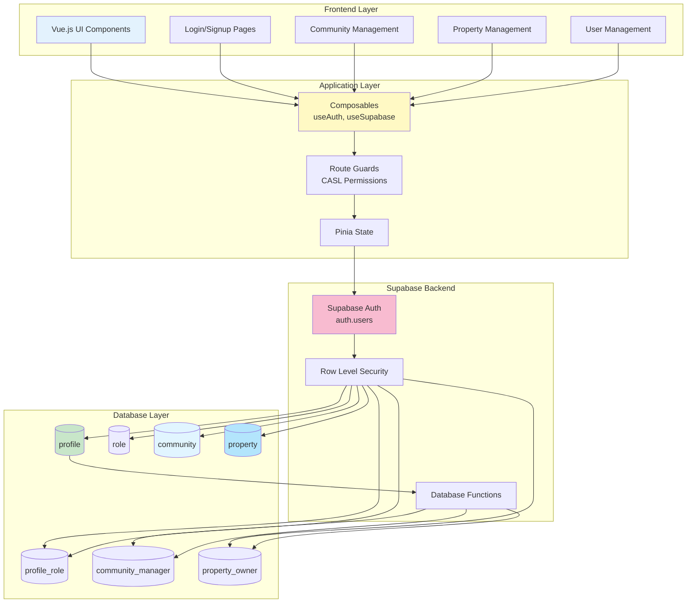
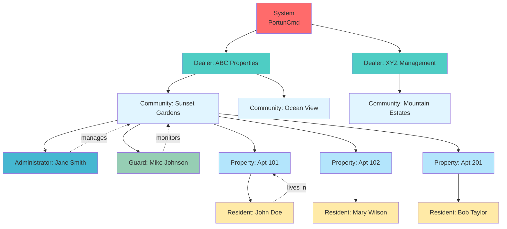
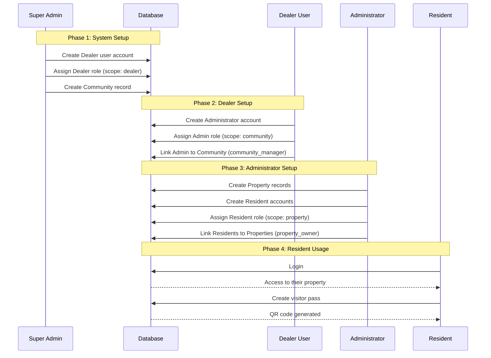
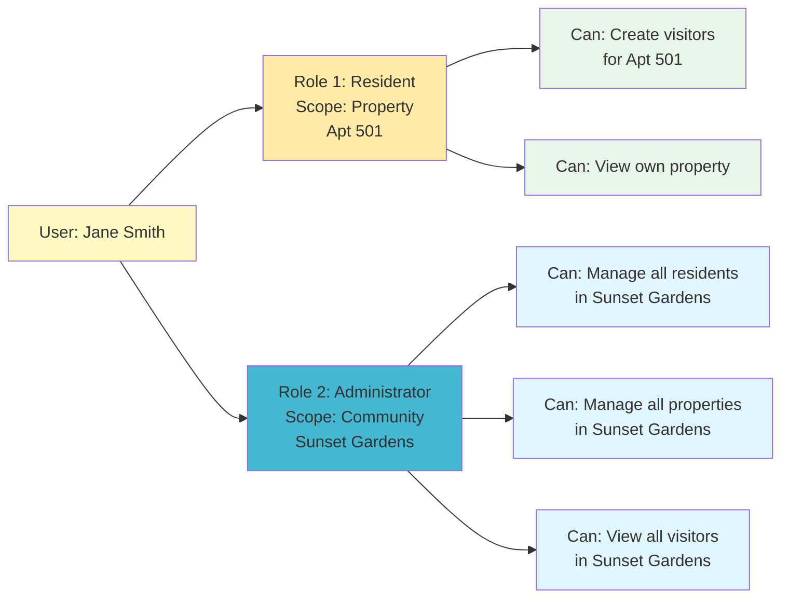

# Data Model Workflows and Visual Guide

This document provides visual workflows and practical examples for working with Communities, Users, and Properties in PortunCmd.

## Table of Contents

1. [Data Flow Overview](#data-flow-overview)
2. [Visual Workflows](#visual-workflows)
3. [Common Operations](#common-operations)
4. [Database Query Examples](#database-query-examples)
5. [Troubleshooting](#troubleshooting)

---

## Data Flow Overview

### System Architecture Layers



### Data Entity Hierarchy



---

## Visual Workflows

### Workflow 1: Complete Community Setup (From Scratch)



### Workflow 2: Adding a New Resident (Existing Community)

```mermaid
flowchart TB
    START([Administrator wants to add new resident]) --> CHECK1{Does user<br/>account exist?}

    CHECK1 -->|No| CREATE_AUTH[Create Supabase Auth account<br/>via email invite]
    CHECK1 -->|Yes| VERIFY_PROFILE

    CREATE_AUTH --> VERIFY_PROFILE{Does profile<br/>record exist?}

    VERIFY_PROFILE -->|No| CREATE_PROFILE[Create profile record<br/>enabled = true]
    VERIFY_PROFILE -->|Yes| CHECK_ENABLED

    CREATE_PROFILE --> CHECK_PROPERTY

    CHECK_ENABLED{Is profile<br/>enabled?}
    CHECK_ENABLED -->|No| ENABLE[Set enabled = true]
    CHECK_ENABLED -->|Yes| CHECK_PROPERTY

    ENABLE --> CHECK_PROPERTY

    CHECK_PROPERTY{Which property?}
    CHECK_PROPERTY -->|Existing property| ASSIGN_ROLE
    CHECK_PROPERTY -->|Need new property| CREATE_PROP[Create property record<br/>linked to community]

    CREATE_PROP --> ASSIGN_ROLE[Assign Resident role<br/>scope = property<br/>scope_property_ids = [property_id]]

    ASSIGN_ROLE --> CREATE_OWNER[Create property_owner record<br/>profile_id + property_id + community_id]

    CREATE_OWNER --> SET_DEFAULTS[Set default community & property<br/>in profile table]

    SET_DEFAULTS --> TEST[Test: Resident logs in<br/>Can they see their property?]

    TEST -->|Yes| SUCCESS([Success:<br/>Resident added])
    TEST -->|No| DEBUG[Debug: Check RLS policies<br/>and scope assignments]

    DEBUG --> SUCCESS

    style CREATE_AUTH fill:#fff9c4
    style CREATE_PROFILE fill:#fff9c4
    style CREATE_PROP fill:#b3e5fc
    style ASSIGN_ROLE fill:#f8bbd0
    style CREATE_OWNER fill:#c8e6c9
    style SET_DEFAULTS fill:#ffe0b2
    style SUCCESS fill:#a5d6a7
```

### Workflow 3: Multi-Role User Assignment



### Workflow 4: Data Access Patterns by Role

```mermaid
graph TB
    subgraph "Super Admin View"
        SA[Super Admin] --> SA_ALL[Can access ALL communities,<br/>ALL properties,<br/>ALL users]
    end

    subgraph "Dealer View"
        DEALER[Dealer] --> DEALER_COMM[Can access communities<br/>they manage]
        DEALER_COMM --> DEALER_ADMIN[Can see their administrators]
        DEALER_COMM --> DEALER_PROPS[Can see properties<br/>in their communities]
    end

    subgraph "Administrator View"
        ADMIN[Administrator] --> ADMIN_COMM[Can access assigned<br/>communities only]
        ADMIN_COMM --> ADMIN_PROPS[Can manage properties<br/>in assigned communities]
        ADMIN_COMM --> ADMIN_RES[Can manage residents<br/>in assigned communities]
    end

    subgraph "Guard View"
        GUARD[Guard] --> GUARD_COMM[Can view assigned<br/>communities only]
        GUARD_COMM --> GUARD_VIS[Can view/update visitors]
        GUARD_COMM --> GUARD_GATE[Can control gate access]
    end

    subgraph "Resident View"
        RES[Resident] --> RES_PROP[Can only access<br/>owned properties]
        RES_PROP --> RES_VIS[Can create visitors<br/>for own property]
    end

    style SA fill:#ff6b6b
    style DEALER fill:#4ecdc4
    style ADMIN fill:#45b7d1
    style GUARD fill:#96ceb4
    style RES fill:#ffeaa7
```



---

## Common Operations

### Operation 1: Bulk Property Creation

**Scenario**: Adding 50 apartments to a new building in existing community

```sql
-- Method 1: Generate series for sequential units
INSERT INTO property (id, name, address, community_id)
SELECT
  'sunset-gardens-tower-a-' || LPAD(unit_num::text, 3, '0'),
  'Tower A - Apartment ' || unit_num,
  'Tower A, Floor ' || CEIL(unit_num::numeric / 5),
  'sunset-gardens'
FROM generate_series(101, 150) AS unit_num;

-- Method 2: Manual batch insert
INSERT INTO property (id, name, address, community_id) VALUES
  ('sunset-gardens-apt-101', 'Apartment 101', 'Building A, Floor 1', 'sunset-gardens'),
  ('sunset-gardens-apt-102', 'Apartment 102', 'Building A, Floor 1', 'sunset-gardens'),
  ('sunset-gardens-apt-103', 'Apartment 103', 'Building A, Floor 1', 'sunset-gardens');
  -- ... continue for all units
```

### Operation 2: Transferring Property Ownership

**Scenario**: Resident moves out, new resident moves in

```sql
BEGIN;

-- Step 1: Deactivate old resident's property_owner record
DELETE FROM property_owner
WHERE profile_id = 'old-resident-uuid'
  AND property_id = 'sunset-gardens-apt-101';

-- Step 2: Remove old resident's role if they have no other properties
DELETE FROM profile_role
WHERE profile_id = 'old-resident-uuid'
  AND role_id = (SELECT id FROM role WHERE role_name = 'Resident')
  AND NOT EXISTS (
    SELECT 1 FROM property_owner WHERE profile_id = 'old-resident-uuid'
  );

-- Step 3: Create new resident's property_owner record
INSERT INTO property_owner (profile_id, property_id, community_id)
VALUES ('new-resident-uuid', 'sunset-gardens-apt-101', 'sunset-gardens');

-- Step 4: Assign Resident role to new resident (if they don't have it)
INSERT INTO profile_role (profile_id, role_id, scope_type, scope_property_ids)
VALUES (
  'new-resident-uuid',
  (SELECT id FROM role WHERE role_name = 'Resident'),
  'property',
  ARRAY['sunset-gardens-apt-101']
)
ON CONFLICT DO NOTHING;

-- Step 5: Update new resident's defaults
UPDATE profile
SET
  def_community_id = 'sunset-gardens',
  def_property_id = 'sunset-gardens-apt-101'
WHERE id = 'new-resident-uuid';

COMMIT;
```

### Operation 3: Assigning Administrator to Multiple Communities

**Scenario**: One administrator manages 3 communities

```sql
BEGIN;

-- Step 1: Get or create administrator user
-- (Assume profile already exists with id 'admin-uuid')

-- Step 2: Assign Administrator role with community scope
INSERT INTO profile_role (
  profile_id,
  role_id,
  scope_type,
  scope_community_ids
) VALUES (
  'admin-uuid',
  (SELECT id FROM role WHERE role_name = 'Administrator'),
  'community',
  ARRAY['sunset-gardens', 'ocean-view', 'mountain-estates']
)
ON CONFLICT (profile_id, role_id) DO UPDATE
  SET scope_community_ids = EXCLUDED.scope_community_ids;

-- Step 3: Create community_manager records for each community
INSERT INTO community_manager (profile_id, community_id, property_id)
VALUES
  ('admin-uuid', 'sunset-gardens', NULL),
  ('admin-uuid', 'ocean-view', NULL),
  ('admin-uuid', 'mountain-estates', NULL)
ON CONFLICT DO NOTHING;

COMMIT;
```

### Operation 4: Querying User Access

**Scenario**: What can this user access?

```sql
-- Get all communities a user can access
SELECT DISTINCT c.*
FROM community c
LEFT JOIN community_manager cm ON c.id = cm.community_id
LEFT JOIN property_owner po ON c.id = po.community_id
LEFT JOIN profile_role pr ON pr.profile_id = 'user-uuid'
WHERE
  -- Super Admin: all communities
  pr.scope_type = 'global'
  -- Or community in their scope
  OR c.id = ANY(pr.scope_community_ids)
  -- Or they manage this community
  OR cm.profile_id = 'user-uuid'
  -- Or they own property in this community
  OR po.profile_id = 'user-uuid';

-- Get all properties a user can access
SELECT DISTINCT p.*
FROM property p
LEFT JOIN property_owner po ON p.id = po.property_id
LEFT JOIN profile_role pr ON pr.profile_id = 'user-uuid'
WHERE
  -- Super Admin: all properties
  pr.scope_type = 'global'
  -- Or property in their scope
  OR p.id = ANY(pr.scope_property_ids)
  -- Or property's community in their scope
  OR p.community_id = ANY(pr.scope_community_ids)
  -- Or they own this property
  OR po.profile_id = 'user-uuid';
```

---

## Database Query Examples

### Example 1: Create Complete Community Setup

```sql
-- Transaction ensures all-or-nothing
BEGIN;

-- 1. Create Community
INSERT INTO community (id, name, address, city, state, country)
VALUES (
  'sunset-gardens',
  'Sunset Gardens Condominium',
  '123 Main Street',
  'Miami',
  'Florida',
  'USA'
);

-- 2. Create Properties (20 units)
INSERT INTO property (id, name, address, community_id)
SELECT
  'sunset-gardens-apt-' || LPAD(unit_num::text, 3, '0'),
  'Apartment ' || unit_num,
  'Building A, Floor ' || CEIL(unit_num::numeric / 4),
  'sunset-gardens'
FROM generate_series(101, 120) AS unit_num;

-- 3. Create Administrator (assume profile exists)
INSERT INTO profile_role (profile_id, role_id, scope_type, scope_community_ids)
VALUES (
  'admin-user-uuid',
  (SELECT id FROM role WHERE role_name = 'Administrator'),
  'community',
  ARRAY['sunset-gardens']
);

INSERT INTO community_manager (profile_id, community_id)
VALUES ('admin-user-uuid', 'sunset-gardens');

-- 4. Create Guard
INSERT INTO profile_role (profile_id, role_id, scope_type, scope_community_ids)
VALUES (
  'guard-user-uuid',
  (SELECT id FROM role WHERE role_name = 'Guard'),
  'community',
  ARRAY['sunset-gardens']
);

INSERT INTO community_manager (profile_id, community_id)
VALUES ('guard-user-uuid', 'sunset-gardens');

COMMIT;
```

### Example 2: Check User's Effective Permissions

```sql
-- Get all roles and scopes for a user
SELECT
  p.email,
  p.display_name,
  r.role_name,
  pr.scope_type,
  pr.scope_community_ids,
  pr.scope_property_ids,
  pr.created_at as role_assigned_at
FROM profile p
JOIN profile_role pr ON p.id = pr.profile_id
JOIN role r ON pr.role_id = r.id
WHERE p.id = 'user-uuid'
ORDER BY r.role_name;

-- Get communities user manages
SELECT
  c.name as community_name,
  c.id as community_id,
  COUNT(DISTINCT p.id) as property_count
FROM community c
JOIN community_manager cm ON c.id = cm.community_id
LEFT JOIN property p ON c.id = p.community_id
WHERE cm.profile_id = 'user-uuid'
GROUP BY c.id, c.name;

-- Get properties user owns
SELECT
  c.name as community_name,
  p.name as property_name,
  p.address
FROM property p
JOIN community c ON p.community_id = c.id
JOIN property_owner po ON p.id = po.property_id
WHERE po.profile_id = 'user-uuid';
```

### Example 3: List All Users in a Community

```sql
-- Get all users with access to a specific community
WITH community_users AS (
  -- Administrators
  SELECT DISTINCT
    p.id,
    p.email,
    p.display_name,
    r.role_name,
    'Administrator' as access_type
  FROM profile p
  JOIN community_manager cm ON p.id = cm.profile_id
  JOIN profile_role pr ON p.id = pr.profile_id
  JOIN role r ON pr.role_id = r.id
  WHERE cm.community_id = 'sunset-gardens'
    AND r.role_name = 'Administrator'

  UNION

  -- Guards
  SELECT DISTINCT
    p.id,
    p.email,
    p.display_name,
    r.role_name,
    'Guard' as access_type
  FROM profile p
  JOIN community_manager cm ON p.id = cm.profile_id
  JOIN profile_role pr ON p.id = pr.profile_id
  JOIN role r ON pr.role_id = r.id
  WHERE cm.community_id = 'sunset-gardens'
    AND r.role_name = 'Guard'

  UNION

  -- Residents
  SELECT DISTINCT
    p.id,
    p.email,
    p.display_name,
    r.role_name,
    prop.name as access_type
  FROM profile p
  JOIN property_owner po ON p.id = po.profile_id
  JOIN property prop ON po.property_id = prop.id
  JOIN profile_role pr ON p.id = pr.profile_id
  JOIN role r ON pr.role_id = r.id
  WHERE po.community_id = 'sunset-gardens'
    AND r.role_name = 'Resident'
)
SELECT * FROM community_users
ORDER BY role_name, email;
```

---

## Troubleshooting

### Issue 1: User Can't See Community After Being Assigned

**Symptoms**:
- User logs in successfully
- Dashboard shows no communities
- User has correct role in `profile_role`

**Diagnosis Checklist**:

```sql
-- Step 1: Verify profile is enabled
SELECT id, email, enabled FROM profile WHERE id = 'user-uuid';
-- Expected: enabled = true

-- Step 2: Check role assignment
SELECT r.role_name, pr.scope_type, pr.scope_community_ids
FROM profile_role pr
JOIN role r ON pr.role_id = r.id
WHERE pr.profile_id = 'user-uuid';
-- Expected: role exists with correct scope

-- Step 3: Check relationship table
-- For Administrator/Guard:
SELECT * FROM community_manager WHERE profile_id = 'user-uuid';
-- Expected: record exists linking user to community

-- For Resident:
SELECT * FROM property_owner WHERE profile_id = 'user-uuid';
-- Expected: record exists linking user to property

-- Step 4: Verify community exists
SELECT * FROM community WHERE id = 'sunset-gardens';
-- Expected: community record exists

-- Step 5: Check RLS policies (as Super Admin)
SELECT * FROM pg_policies WHERE tablename = 'community';
-- Expected: policies exist for the user's role
```

**Common Fixes**:
1. Missing relationship record → Create `community_manager` or `property_owner` record
2. Wrong scope type → Update `profile_role.scope_type` and `scope_community_ids`/`scope_property_ids`
3. Profile disabled → Set `profile.enabled = true`
4. Missing role → Insert `profile_role` record

### Issue 2: User Has Multiple Roles, Seeing Wrong Data

**Symptoms**:
- User is both Resident and Administrator
- Only sees resident data or only sees admin data
- Permissions seem to conflict

**Diagnosis**:

```sql
-- Check all roles
SELECT r.role_name, pr.scope_type, pr.scope_community_ids, pr.scope_property_ids
FROM profile_role pr
JOIN role r ON pr.role_id = r.id
WHERE pr.profile_id = 'user-uuid';
```

**Solution**:
- Frontend should handle multiple roles
- User should be able to "switch context" between roles
- RLS policies should use OR logic to combine permissions

### Issue 3: Can't Delete Community (Foreign Key Constraint)

**Symptoms**:
- Error: "update or delete on table 'community' violates foreign key constraint"
- Community has dependent records

**Diagnosis**:

```sql
-- Check what's referencing the community
SELECT COUNT(*) as property_count FROM property WHERE community_id = 'sunset-gardens';
SELECT COUNT(*) as manager_count FROM community_manager WHERE community_id = 'sunset-gardens';
SELECT COUNT(*) as owner_count FROM property_owner WHERE community_id = 'sunset-gardens';
SELECT COUNT(*) as visitor_count FROM visitor_records_uid WHERE community_id = 'sunset-gardens';
```

**Solution**:
Delete in correct order (child records first):

```sql
BEGIN;

-- 1. Delete visitor records
DELETE FROM visitor_records_uid WHERE community_id = 'sunset-gardens';

-- 2. Delete property owners
DELETE FROM property_owner WHERE community_id = 'sunset-gardens';

-- 3. Delete community managers
DELETE FROM community_manager WHERE community_id = 'sunset-gardens';

-- 4. Delete properties
DELETE FROM property WHERE community_id = 'sunset-gardens';

-- 5. Update profiles using this as default
UPDATE profile SET def_community_id = NULL WHERE def_community_id = 'sunset-gardens';

-- 6. Now safe to delete community
DELETE FROM community WHERE id = 'sunset-gardens';

COMMIT;
```

### Issue 4: Resident Can't Create Visitors

**Symptoms**:
- Resident role assigned
- Property owner record exists
- Still getting permission denied

**Diagnosis**:

```sql
-- Check resident's setup
SELECT
  p.email,
  p.enabled,
  r.role_name,
  pr.scope_type,
  pr.scope_property_ids,
  po.property_id
FROM profile p
JOIN profile_role pr ON p.id = pr.profile_id
JOIN role r ON pr.role_id = r.id
LEFT JOIN property_owner po ON p.id = po.profile_id
WHERE p.id = 'resident-uuid';
```

**Common Issues**:
1. `scope_property_ids` doesn't include their property
2. Missing `property_owner` record
3. RLS policy blocking insert

**Fix**:
```sql
-- Update scope to include property
UPDATE profile_role
SET scope_property_ids = ARRAY['sunset-gardens-apt-101']
WHERE profile_id = 'resident-uuid'
  AND role_id = (SELECT id FROM role WHERE role_name = 'Resident');

-- Ensure property_owner record exists
INSERT INTO property_owner (profile_id, property_id, community_id)
VALUES ('resident-uuid', 'sunset-gardens-apt-101', 'sunset-gardens')
ON CONFLICT DO NOTHING;
```

---

## Summary Cheat Sheet

### Quick Reference: Creation Order

1. **Community** → `community` table
2. **Properties** → `property` table (requires community_id)
3. **User Account** → Supabase Auth → `profile` table
4. **Role Assignment** → `profile_role` table (with scope)
5. **Relationship** → `community_manager` OR `property_owner`
6. **Defaults** → Update `profile` (optional)

### Quick Reference: Role Scopes

| Role | Scope Type | Scope Field | Relationship Table |
|------|------------|-------------|-------------------|
| Super Admin | `global` | - | - |
| Dealer | `dealer` | `scope_dealer_id` | `dealer_administrators` |
| Administrator | `community` | `scope_community_ids` | `community_manager` |
| Guard | `community` | `scope_community_ids` | `community_manager` |
| Resident | `property` | `scope_property_ids` | `property_owner` |

### Quick Reference: Required Records

**For Administrator**:
- ✅ `profile` (enabled=true)
- ✅ `profile_role` (Administrator, scope=community)
- ✅ `community_manager` (links to community)

**For Resident**:
- ✅ `profile` (enabled=true)
- ✅ `profile_role` (Resident, scope=property)
- ✅ `property_owner` (links to property)

**For Property**:
- ✅ `property` (linked to community)
- ✅ Community must exist first

---

For more information, see:
- [COMMUNITY_USER_PROPERTY_GUIDE.md](./COMMUNITY_USER_PROPERTY_GUIDE.md) - Comprehensive guide
- [SUPABASE_SCHEMA.md](./SUPABASE_SCHEMA.md) - Database schema reference
- [RBAC_GUIDE.md](./RBAC_GUIDE.md) - Role-based access control
