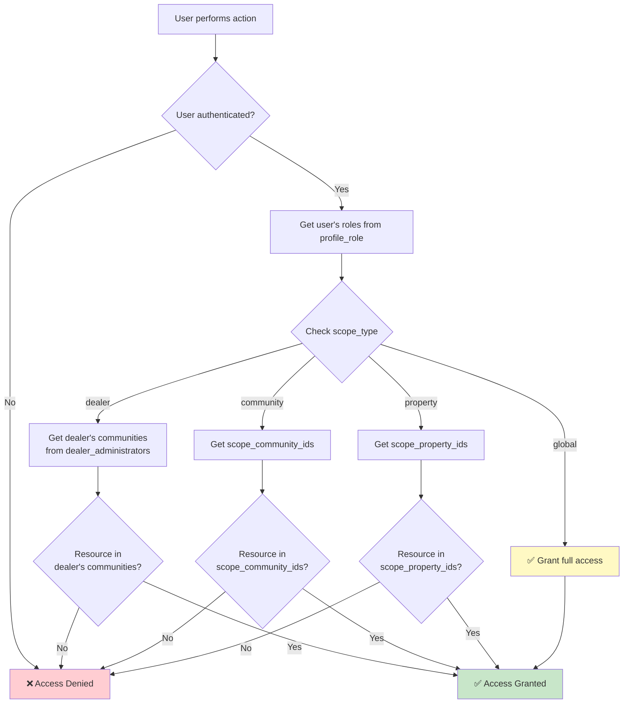

# Scope System Complete Reference Guide

This guide provides a comprehensive understanding of the scope-based access control system in PortunCmd.

## Table of Contents

1. [What is Scope?](#what-is-scope)
2. [The Four Scope Types](#the-four-scope-types)
3. [Scope in the Database](#scope-in-the-database)
4. [How Scopes Work](#how-scopes-work)
5. [Scope Assignment Examples](#scope-assignment-examples)
6. [Scope Enforcement (RLS)](#scope-enforcement-rls)
7. [Multi-Scope Scenarios](#multi-scope-scenarios)
8. [Scope Best Practices](#scope-best-practices)
9. [Common Scope Patterns](#common-scope-patterns)
10. [Troubleshooting Scopes](#troubleshooting-scopes)

---

## What is Scope?

**Scope** defines the **boundaries of access** for a user's role. It answers the question: "Where can this user exercise their permissions?"

### The Core Concept

```
Role = WHAT you can do
Scope = WHERE you can do it
```

**Example**:
- **Role**: "Administrator" gives you management permissions
- **Scope**: "community: sunset-gardens" limits those permissions to Sunset Gardens only

**Without Scope**:
```
❌ Administrator role → Access to ALL communities (too broad)
```

**With Scope**:
```
✅ Administrator role + Community Scope [sunset-gardens] → Access to Sunset Gardens only
```

---

## The Four Scope Types

PortunCmd uses a **hierarchical scope system** with 4 levels, from broadest to narrowest:

### Visual Hierarchy

```
┌─────────────────────────────────────────────────────────┐
│ 1. GLOBAL SCOPE                                         │
│    ┌─────────────────────────────────────────────────┐  │
│    │ 2. DEALER SCOPE                                 │  │
│    │    ┌─────────────────────────────────────────┐  │  │
│    │    │ 3. COMMUNITY SCOPE                      │  │  │
│    │    │    ┌─────────────────────────────────┐  │  │  │
│    │    │    │ 4. PROPERTY SCOPE               │  │  │  │
│    │    │    │  Individual units/properties    │  │  │  │
│    │    │    └─────────────────────────────────┘  │  │  │
│    │    │  Specific communities                   │  │  │
│    │    └─────────────────────────────────────────┘  │  │
│    │  Dealer's portfolio of communities              │  │
│    └─────────────────────────────────────────────────┘  │
│  Entire system                                          │
└─────────────────────────────────────────────────────────┘
```

### Detailed Breakdown

#### 1. Global Scope (`global`)

**Who uses it**: Super Admin only

**Access Level**: Unlimited - entire system

**Database Fields**:
```sql
profile_role {
  scope_type: 'global'
  scope_dealer_id: NULL
  scope_community_ids: NULL
  scope_property_ids: NULL
}
```

**What they can access**:
- ✅ All communities
- ✅ All properties
- ✅ All users
- ✅ All data in the system
- ✅ System configuration
- ✅ Can create/delete communities
- ✅ Can manage all roles

**Visual Representation**:
```
👑 Super Admin (Global Scope)
    │
    ├── 🏢 Community A
    │   ├── 🏠 Property A1
    │   ├── 🏠 Property A2
    │   └── 🏠 Property A3
    │
    ├── 🏢 Community B
    │   ├── 🏠 Property B1
    │   └── 🏠 Property B2
    │
    └── 🏢 Community C
        └── 🏠 Property C1

    ✅ Can access and manage EVERYTHING
```

**Example SQL**:
```sql
-- Assign Super Admin with global scope
INSERT INTO profile_role (
  profile_id,
  role_id,
  scope_type
) VALUES (
  'admin-uuid',
  (SELECT id FROM role WHERE role_name = 'Super Admin'),
  'global'
);

-- No additional fields needed - global means everything
```

---

#### 2. Dealer Scope (`dealer`)

**Who uses it**: Mega Dealer and Dealer roles

**Access Level**: Multiple communities they manage + their administrators (and subordinate dealers for Mega Dealer)

**Database Fields**:
```sql
profile_role {
  scope_type: 'dealer'
  scope_dealer_id: 'dealer-uuid' (self-reference)
  scope_community_ids: NULL (derived from dealer_administrators table)
  scope_property_ids: NULL
}
```

**What they can access**:
- ✅ Communities they own/manage (via `dealer_administrators` table)
- ✅ Properties in those communities
- ✅ Administrators they've assigned
- ✅ Residents in their communities
- ✅ Community statistics and reports
- ❌ Communities owned by other dealers
- ❌ System-wide configuration

**Visual Representation**:
```
🏪 Dealer: ABC Properties (Dealer Scope)
    │
    ├── 🏢 Community A (owned)
    │   ├── 👨‍💼 Administrator: Jane
    │   ├── 🏠 Property A1 → 👤 Resident: John
    │   └── 🏠 Property A2 → 👤 Resident: Mary
    │
    ├── 🏢 Community B (owned)
    │   ├── 👨‍💼 Administrator: Bob
    │   └── 🏠 Property B1 → 👤 Resident: Sue
    │
    └── ❌ Community C (NOT owned - no access)
```

**Example SQL**:
```sql
-- Step 1: Assign Dealer role with dealer scope
INSERT INTO profile_role (
  profile_id,
  role_id,
  scope_type,
  scope_dealer_id
) VALUES (
  'dealer-uuid',
  (SELECT id FROM role WHERE role_name = 'Dealer'),
  'dealer',
  'dealer-uuid'  -- Self-reference
);

-- Step 2: Link dealer to their communities via administrators
INSERT INTO dealer_administrators (
  dealer_id,
  administrator_id,
  assigned_community_ids
) VALUES
  ('dealer-uuid', 'admin1-uuid', ARRAY['community-a', 'community-b']),
  ('dealer-uuid', 'admin2-uuid', ARRAY['community-c']);

-- Now dealer can access communities A, B, and C through their admins
```

**How Dealer Scope Works**:
1. Dealer is assigned `scope_type = 'dealer'`
2. Communities are linked via `dealer_administrators` table
3. RLS policies check: "Is this community managed by an admin assigned to this dealer?"
4. Access is granted if match found

---

#### 3. Community Scope (`community`)

**Who uses it**: Administrator, Guard, and Client roles

**Access Level**: Specific communities only

**Database Fields**:
```sql
profile_role {
  scope_type: 'community'
  scope_dealer_id: NULL
  scope_community_ids: ['community-a', 'community-b'] (array)
  scope_property_ids: NULL
}
```

**What they can access**:

**Administrators**:
- ✅ Assigned communities
- ✅ All properties in those communities
- ✅ All residents in those communities
- ✅ Manage visitors for those communities
- ✅ Control automation devices
- ✅ View reports for those communities
- ❌ Other communities
- ❌ System-wide settings

**Guards**:
- ✅ View assigned communities
- ✅ View properties in those communities
- ✅ View residents (read-only)
- ✅ View/update visitor records
- ✅ Control gate access
- ❌ Cannot create/delete properties
- ❌ Cannot create/delete residents
- ❌ Other communities

**Visual Representation**:

**Administrator with Multi-Community Scope**:
```
👨‍💼 Administrator: Jane (Community Scope: [A, B])
    │
    ├── ✅ 🏢 Community A
    │   ├── 🏠 Property A1 (can manage)
    │   ├── 🏠 Property A2 (can manage)
    │   └── 👤 Residents (can manage)
    │
    ├── ✅ 🏢 Community B
    │   ├── 🏠 Property B1 (can manage)
    │   └── 👤 Residents (can manage)
    │
    └── ❌ 🏢 Community C (no access)
```

**Guard with Single-Community Scope**:
```
💂 Guard: Mike (Community Scope: [A])
    │
    ├── ✅ 🏢 Community A
    │   ├── 🏠 Property A1 (can view)
    │   ├── 🏠 Property A2 (can view)
    │   ├── 👤 Residents (can view)
    │   └── 🚪 Gate devices (can control)
    │
    └── ❌ 🏢 Community B (no access)
```

**Example SQL**:

**Administrator with single community**:
```sql
-- Assign Administrator role
INSERT INTO profile_role (
  profile_id,
  role_id,
  scope_type,
  scope_community_ids
) VALUES (
  'admin-uuid',
  (SELECT id FROM role WHERE role_name = 'Administrator'),
  'community',
  ARRAY['sunset-gardens']  -- Single community
);

-- Link to community
INSERT INTO community_manager (
  profile_id,
  community_id,
  property_id
) VALUES (
  'admin-uuid',
  'sunset-gardens',
  NULL  -- NULL = manages entire community
);
```

**Administrator with multiple communities**:
```sql
-- Assign Administrator role with multiple communities
INSERT INTO profile_role (
  profile_id,
  role_id,
  scope_type,
  scope_community_ids
) VALUES (
  'admin-uuid',
  (SELECT id FROM role WHERE role_name = 'Administrator'),
  'community',
  ARRAY['sunset-gardens', 'ocean-view', 'mountain-estates']  -- Multiple
);

-- Link to each community
INSERT INTO community_manager (profile_id, community_id, property_id)
VALUES
  ('admin-uuid', 'sunset-gardens', NULL),
  ('admin-uuid', 'ocean-view', NULL),
  ('admin-uuid', 'mountain-estates', NULL);
```

**Guard with community scope**:
```sql
-- Assign Guard role
INSERT INTO profile_role (
  profile_id,
  role_id,
  scope_type,
  scope_community_ids
) VALUES (
  'guard-uuid',
  (SELECT id FROM role WHERE role_name = 'Guard'),
  'community',
  ARRAY['sunset-gardens']
);

-- Link to community
INSERT INTO community_manager (
  profile_id,
  community_id,
  property_id
) VALUES (
  'guard-uuid',
  'sunset-gardens',
  NULL
);
```

---

#### 4. Property Scope (`property`)

**Who uses it**: Resident role

**Access Level**: Specific properties only

**Database Fields**:
```sql
profile_role {
  scope_type: 'property'
  scope_dealer_id: NULL
  scope_community_ids: NULL
  scope_property_ids: ['apt-101', 'apt-102'] (array)
}
```

**What they can access**:
- ✅ Properties they own/rent
- ✅ Community information (read-only context)
- ✅ Create visitor passes for their properties
- ✅ View their visitor history
- ✅ View their property details
- ❌ Other properties
- ❌ Other residents' data
- ❌ Community management functions

**Visual Representation**:

**Resident with Single Property**:
```
🏠 Resident: John (Property Scope: [apt-101])
    │
    └── ✅ 🏠 Apartment 101
        ├── Can create visitors
        ├── Can view visitor logs
        └── Can view property details

    ❌ Apartment 102 (no access)
    ❌ Apartment 201 (no access)
```

**Resident with Multiple Properties** (e.g., owns 2 apartments):
```
🏠 Resident: Mary (Property Scope: [apt-101, apt-201])
    │
    ├── ✅ 🏠 Apartment 101
    │   ├── Can create visitors
    │   └── Can view logs
    │
    └── ✅ 🏠 Apartment 201
        ├── Can create visitors
        └── Can view logs

    ❌ Apartment 102 (no access)
```

**Example SQL**:

**Resident with single property**:
```sql
-- Assign Resident role
INSERT INTO profile_role (
  profile_id,
  role_id,
  scope_type,
  scope_property_ids
) VALUES (
  'resident-uuid',
  (SELECT id FROM role WHERE role_name = 'Resident'),
  'property',
  ARRAY['sunset-gardens-apt-101']  -- Single property
);

-- Link to property
INSERT INTO property_owner (
  profile_id,
  property_id,
  community_id
) VALUES (
  'resident-uuid',
  'sunset-gardens-apt-101',
  'sunset-gardens'
);
```

**Resident with multiple properties** (co-ownership or owns 2 units):
```sql
-- Assign Resident role with multiple properties
INSERT INTO profile_role (
  profile_id,
  role_id,
  scope_type,
  scope_property_ids
) VALUES (
  'resident-uuid',
  (SELECT id FROM role WHERE role_name = 'Resident'),
  'property',
  ARRAY['sunset-gardens-apt-101', 'sunset-gardens-apt-201', 'parking-space-12']
);

-- Link to each property
INSERT INTO property_owner (profile_id, property_id, community_id)
VALUES
  ('resident-uuid', 'sunset-gardens-apt-101', 'sunset-gardens'),
  ('resident-uuid', 'sunset-gardens-apt-201', 'sunset-gardens'),
  ('resident-uuid', 'parking-space-12', 'sunset-gardens');
```

---

## Scope in the Database

### `profile_role` Table Structure

```sql
CREATE TABLE profile_role (
  id UUID PRIMARY KEY,
  profile_id UUID REFERENCES profile(id),
  role_id UUID REFERENCES role(id),

  -- SCOPE FIELDS --
  scope_type VARCHAR(50) DEFAULT 'global',  -- 'global', 'dealer', 'community', 'property'
  scope_dealer_id UUID REFERENCES profile(id),  -- For dealer scope (self-reference)
  scope_community_ids TEXT[],  -- Array of community IDs
  scope_property_ids TEXT[],  -- Array of property IDs

  -- AUDIT FIELDS --
  granted_by UUID,
  granted_at TIMESTAMPTZ,
  expires_at TIMESTAMPTZ,
  notes TEXT,

  created_at TIMESTAMPTZ DEFAULT NOW(),
  updated_at TIMESTAMPTZ DEFAULT NOW()
);
```

### Scope Field Usage by Type

| Scope Type | `scope_dealer_id` | `scope_community_ids` | `scope_property_ids` | Relationship Table |
|------------|-------------------|----------------------|---------------------|-------------------|
| `global` | NULL | NULL | NULL | None |
| `dealer` | Self-reference | NULL (from `dealer_administrators`) | NULL | `dealer_administrators` |
| `community` | NULL | Array of community IDs | NULL | `community_manager` |
| `property` | NULL | NULL | Array of property IDs | `property_owner` |

### Example Records

```sql
-- Super Admin (global scope)
{
  id: 'role-1',
  profile_id: 'super-admin-uuid',
  role_id: 'super-admin-role-id',
  scope_type: 'global',
  scope_dealer_id: NULL,
  scope_community_ids: NULL,
  scope_property_ids: NULL
}

-- Dealer (dealer scope)
{
  id: 'role-2',
  profile_id: 'dealer-uuid',
  role_id: 'dealer-role-id',
  scope_type: 'dealer',
  scope_dealer_id: 'dealer-uuid',  -- Self-reference
  scope_community_ids: NULL,  -- Derived from dealer_administrators
  scope_property_ids: NULL
}

-- Administrator (community scope)
{
  id: 'role-3',
  profile_id: 'admin-uuid',
  role_id: 'admin-role-id',
  scope_type: 'community',
  scope_dealer_id: NULL,
  scope_community_ids: ['sunset-gardens', 'ocean-view'],
  scope_property_ids: NULL
}

-- Resident (property scope)
{
  id: 'role-4',
  profile_id: 'resident-uuid',
  role_id: 'resident-role-id',
  scope_type: 'property',
  scope_dealer_id: NULL,
  scope_community_ids: NULL,
  scope_property_ids: ['apt-101', 'apt-201']
}
```

---

## How Scopes Work

### Scope Resolution Flow



### RLS Policy Example

Here's how scope is enforced in Row Level Security:

```sql
-- Example: Community table RLS policy for community scope

-- Administrators can view communities in their scope
CREATE POLICY "community_view_admin" ON community
FOR SELECT
USING (
  -- Check if user is an Administrator
  EXISTS (
    SELECT 1 FROM profile_role pr
    JOIN role r ON pr.role_id = r.id
    WHERE pr.profile_id = auth.uid()
      AND r.role_name = 'Administrator'
      AND (
        -- Global scope = see all
        pr.scope_type = 'global'
        OR
        -- Community scope = see if community in scope_community_ids
        (pr.scope_type = 'community' AND community.id = ANY(pr.scope_community_ids))
      )
  )
);

-- Residents can view their community (derived from property ownership)
CREATE POLICY "community_view_resident" ON community
FOR SELECT
USING (
  EXISTS (
    SELECT 1
    FROM property_owner po
    JOIN property p ON po.property_id = p.id
    WHERE po.profile_id = auth.uid()
      AND p.community_id = community.id
  )
);
```

### Scope Checking in Application Code

```typescript
// Example composable: useUserScope.ts
export const useUserScope = () => {
  const getUserCommunities = async (userId: string): Promise<string[]> => {
    // Get user's roles
    const { data: roles } = await supabase
      .from('profile_role')
      .select('scope_type, scope_community_ids, scope_dealer_id')
      .eq('profile_id', userId)

    if (!roles) return []

    const communities: string[] = []

    for (const role of roles) {
      if (role.scope_type === 'global') {
        // Global = all communities
        const { data: allCommunities } = await supabase
          .from('community')
          .select('id')
        return allCommunities?.map(c => c.id) || []
      }

      if (role.scope_type === 'dealer' && role.scope_dealer_id) {
        // Get dealer's communities
        const { data: dealerComms } = await supabase
          .from('dealer_administrators')
          .select('assigned_community_ids')
          .eq('dealer_id', role.scope_dealer_id)

        dealerComms?.forEach(d => {
          communities.push(...(d.assigned_community_ids || []))
        })
      }

      if (role.scope_type === 'community' && role.scope_community_ids) {
        // Add community scope communities
        communities.push(...role.scope_community_ids)
      }

      if (role.scope_type === 'property' && role.scope_property_ids) {
        // Get communities from properties
        const { data: props } = await supabase
          .from('property')
          .select('community_id')
          .in('id', role.scope_property_ids)

        props?.forEach(p => {
          if (p.community_id) communities.push(p.community_id)
        })
      }
    }

    // Return unique communities
    return [...new Set(communities)]
  }

  return { getUserCommunities }
}
```

---

## Scope Assignment Examples

### Complete Examples for Each Scope

#### Example 1: Assigning Global Scope (Super Admin)

```sql
-- Complete transaction
BEGIN;

-- Step 1: Ensure profile exists
-- (Assume profile already created via Supabase Auth)

-- Step 2: Assign Super Admin role with global scope
INSERT INTO profile_role (
  profile_id,
  role_id,
  scope_type,
  granted_by,
  granted_at,
  notes
) VALUES (
  'super-admin-uuid',
  (SELECT id FROM role WHERE role_name = 'Super Admin'),
  'global',  -- No scope restrictions
  'system',  -- Granted by system setup
  NOW(),
  'System administrator with full access'
);

-- Step 3: No relationship tables needed for global scope

COMMIT;

-- Verify
SELECT
  p.email,
  r.role_name,
  pr.scope_type
FROM profile p
JOIN profile_role pr ON p.id = pr.profile_id
JOIN role r ON pr.role_id = r.id
WHERE p.id = 'super-admin-uuid';
```

#### Example 2: Assigning Dealer Scope

```sql
BEGIN;

-- Step 1: Assign Dealer role
INSERT INTO profile_role (
  profile_id,
  role_id,
  scope_type,
  scope_dealer_id,
  granted_by,
  notes
) VALUES (
  'dealer-uuid',
  (SELECT id FROM role WHERE role_name = 'Dealer'),
  'dealer',
  'dealer-uuid',  -- Self-reference
  'super-admin-uuid',
  'Dealer managing multiple communities'
);

-- Step 2: Create administrators under this dealer
-- (Assume admin profiles already exist)

-- Step 3: Link administrators to dealer with community assignments
INSERT INTO dealer_administrators (
  dealer_id,
  administrator_id,
  assigned_community_ids,
  assigned_by
) VALUES
  (
    'dealer-uuid',
    'admin1-uuid',
    ARRAY['sunset-gardens', 'ocean-view'],
    'dealer-uuid'
  ),
  (
    'dealer-uuid',
    'admin2-uuid',
    ARRAY['mountain-estates'],
    'dealer-uuid'
  );

COMMIT;

-- Verify dealer's communities
SELECT
  p.email as dealer_email,
  da.administrator_id,
  da.assigned_community_ids
FROM profile p
JOIN dealer_administrators da ON p.id = da.dealer_id
WHERE p.id = 'dealer-uuid';
```

#### Example 3: Assigning Community Scope (Administrator)

```sql
BEGIN;

-- Step 1: Assign Administrator role with community scope
INSERT INTO profile_role (
  profile_id,
  role_id,
  scope_type,
  scope_community_ids,
  granted_by,
  notes
) VALUES (
  'admin-uuid',
  (SELECT id FROM role WHERE role_name = 'Administrator'),
  'community',
  ARRAY['sunset-gardens'],  -- Can manage Sunset Gardens only
  'dealer-uuid',
  'Community administrator for Sunset Gardens'
);

-- Step 2: Link administrator to community
INSERT INTO community_manager (
  profile_id,
  community_id,
  property_id  -- NULL = manages entire community
) VALUES (
  'admin-uuid',
  'sunset-gardens',
  NULL
);

COMMIT;

-- Verify
SELECT
  p.email,
  r.role_name,
  pr.scope_type,
  pr.scope_community_ids,
  cm.community_id
FROM profile p
JOIN profile_role pr ON p.id = pr.profile_id
JOIN role r ON pr.role_id = r.id
LEFT JOIN community_manager cm ON p.id = cm.profile_id
WHERE p.id = 'admin-uuid';
```

#### Example 4: Assigning Community Scope (Guard)

```sql
BEGIN;

-- Step 1: Assign Guard role
INSERT INTO profile_role (
  profile_id,
  role_id,
  scope_type,
  scope_community_ids,
  granted_by,
  notes
) VALUES (
  'guard-uuid',
  (SELECT id FROM role WHERE role_name = 'Guard'),
  'community',
  ARRAY['sunset-gardens'],
  'admin-uuid',
  'Security guard for Sunset Gardens'
);

-- Step 2: Link guard to community
INSERT INTO community_manager (
  profile_id,
  community_id,
  property_id
) VALUES (
  'guard-uuid',
  'sunset-gardens',
  NULL
);

COMMIT;
```

#### Example 5: Assigning Property Scope (Resident)

```sql
BEGIN;

-- Step 1: Assign Resident role with property scope
INSERT INTO profile_role (
  profile_id,
  role_id,
  scope_type,
  scope_property_ids,
  granted_by,
  notes
) VALUES (
  'resident-uuid',
  (SELECT id FROM role WHERE role_name = 'Resident'),
  'property',
  ARRAY['sunset-gardens-apt-101'],  -- Single property
  'admin-uuid',
  'Resident of Apartment 101'
);

-- Step 2: Link resident to property
INSERT INTO property_owner (
  profile_id,
  property_id,
  community_id
) VALUES (
  'resident-uuid',
  'sunset-gardens-apt-101',
  'sunset-gardens'
);

-- Step 3: Set defaults for convenience
UPDATE profile
SET
  def_community_id = 'sunset-gardens',
  def_property_id = 'sunset-gardens-apt-101'
WHERE id = 'resident-uuid';

COMMIT;

-- Verify
SELECT
  p.email,
  r.role_name,
  pr.scope_type,
  pr.scope_property_ids,
  po.property_id,
  po.community_id
FROM profile p
JOIN profile_role pr ON p.id = pr.profile_id
JOIN role r ON pr.role_id = r.id
JOIN property_owner po ON p.id = po.profile_id
WHERE p.id = 'resident-uuid';
```

---

## Scope Enforcement (RLS)

### How RLS Policies Use Scope

Row Level Security (RLS) policies in PostgreSQL use the `profile_role` scope fields to filter data:

#### Pattern 1: Global Scope Bypass

```sql
-- If user has global scope, allow everything
CREATE POLICY "table_global_access" ON some_table
FOR ALL
USING (
  EXISTS (
    SELECT 1 FROM profile_role pr
    JOIN role r ON pr.role_id = r.id
    WHERE pr.profile_id = auth.uid()
      AND pr.scope_type = 'global'
  )
);
```

#### Pattern 2: Community Scope Filtering

```sql
-- Filter by community scope
CREATE POLICY "community_scope_access" ON community
FOR SELECT
USING (
  -- Super Admin can see all
  EXISTS (
    SELECT 1 FROM profile_role pr
    WHERE pr.profile_id = auth.uid() AND pr.scope_type = 'global'
  )
  OR
  -- Admin can see communities in their scope
  EXISTS (
    SELECT 1 FROM profile_role pr
    JOIN role r ON pr.role_id = r.id
    WHERE pr.profile_id = auth.uid()
      AND r.role_name IN ('Administrator', 'Guard')
      AND pr.scope_type = 'community'
      AND community.id = ANY(pr.scope_community_ids)
  )
);
```

#### Pattern 3: Property Scope Filtering

```sql
-- Residents can only see their properties
CREATE POLICY "property_resident_view" ON property
FOR SELECT
USING (
  EXISTS (
    SELECT 1
    FROM profile_role pr
    JOIN role r ON pr.role_id = r.id
    WHERE pr.profile_id = auth.uid()
      AND r.role_name = 'Resident'
      AND pr.scope_type = 'property'
      AND property.id = ANY(pr.scope_property_ids)
  )
);
```

#### Pattern 4: Dealer Scope Filtering

```sql
-- Dealers can see communities assigned to their administrators
CREATE POLICY "community_dealer_view" ON community
FOR SELECT
USING (
  EXISTS (
    SELECT 1
    FROM profile_role pr
    JOIN dealer_administrators da ON pr.scope_dealer_id = da.dealer_id
    WHERE pr.profile_id = auth.uid()
      AND pr.scope_type = 'dealer'
      AND community.id = ANY(da.assigned_community_ids)
  )
);
```

### Complete RLS Example: visitor_records_uid

```sql
-- Super Admin can see all visitor records
CREATE POLICY "visitor_super_admin" ON visitor_records_uid
FOR ALL
USING (
  EXISTS (
    SELECT 1 FROM profile_role pr
    WHERE pr.profile_id = auth.uid() AND pr.scope_type = 'global'
  )
);

-- Administrators can see visitors in their communities
CREATE POLICY "visitor_admin_view" ON visitor_records_uid
FOR SELECT
USING (
  EXISTS (
    SELECT 1
    FROM profile_role pr
    JOIN role r ON pr.role_id = r.id
    WHERE pr.profile_id = auth.uid()
      AND r.role_name = 'Administrator'
      AND pr.scope_type = 'community'
      AND visitor_records_uid.community_id = ANY(pr.scope_community_ids)
  )
);

-- Guards can see visitors in their communities
CREATE POLICY "visitor_guard_view" ON visitor_records_uid
FOR SELECT
USING (
  EXISTS (
    SELECT 1
    FROM profile_role pr
    JOIN role r ON pr.role_id = r.id
    WHERE pr.profile_id = auth.uid()
      AND r.role_name = 'Guard'
      AND pr.scope_type = 'community'
      AND visitor_records_uid.community_id = ANY(pr.scope_community_ids)
  )
);

-- Residents can see their own visitor records
CREATE POLICY "visitor_resident_view" ON visitor_records_uid
FOR SELECT
USING (
  -- Option 1: They are the host
  visitor_records_uid.host_uid = auth.uid()
  OR
  -- Option 2: Visitor is for their property
  EXISTS (
    SELECT 1
    FROM profile_role pr
    JOIN role r ON pr.role_id = r.id
    WHERE pr.profile_id = auth.uid()
      AND r.role_name = 'Resident'
      AND pr.scope_type = 'property'
      AND visitor_records_uid.property_id = ANY(pr.scope_property_ids)
  )
);

-- Residents can create visitors for their properties
CREATE POLICY "visitor_resident_create" ON visitor_records_uid
FOR INSERT
WITH CHECK (
  EXISTS (
    SELECT 1
    FROM profile_role pr
    JOIN role r ON pr.role_id = r.id
    WHERE pr.profile_id = auth.uid()
      AND r.role_name = 'Resident'
      AND pr.scope_type = 'property'
      AND visitor_records_uid.property_id = ANY(pr.scope_property_ids)
  )
);
```

---

## Multi-Scope Scenarios

Users can have **multiple roles with different scopes**. This is common and powerful.

### Scenario 1: Administrator Who is Also a Resident

```sql
-- User has TWO roles
INSERT INTO profile_role (profile_id, role_id, scope_type, scope_community_ids) VALUES
  ('user-uuid', (SELECT id FROM role WHERE role_name = 'Administrator'), 'community', ARRAY['sunset-gardens']);

INSERT INTO profile_role (profile_id, role_id, scope_type, scope_property_ids) VALUES
  ('user-uuid', (SELECT id FROM role WHERE role_name = 'Resident'), 'property', ARRAY['apt-501']);

-- Relationships
INSERT INTO community_manager (profile_id, community_id) VALUES
  ('user-uuid', 'sunset-gardens');

INSERT INTO property_owner (profile_id, property_id, community_id) VALUES
  ('user-uuid', 'apt-501', 'sunset-gardens');
```

**What they can do**:
- **As Administrator**: Manage all properties and residents in Sunset Gardens
- **As Resident**: Create visitor passes for Apartment 501
- **Combined**: Full management rights + personal property access

**RLS Resolution**: Policies use `OR` logic, so user gets union of both scopes

### Scenario 2: Dealer Who is Also Super Admin

```sql
-- Super Admin role (global)
INSERT INTO profile_role (profile_id, role_id, scope_type) VALUES
  ('user-uuid', (SELECT id FROM role WHERE role_name = 'Super Admin'), 'global');

-- Dealer role (for business separation)
INSERT INTO profile_role (profile_id, role_id, scope_type, scope_dealer_id) VALUES
  ('user-uuid', (SELECT id FROM role WHERE role_name = 'Dealer'), 'dealer', 'user-uuid');
```

**What they can do**:
- **As Super Admin**: Access everything in the system
- **As Dealer**: Manage their dealer-specific operations
- **Combined**: Complete control with organizational structure

### Scenario 3: Multi-Community Administrator

```sql
-- Administrator for 3 communities
INSERT INTO profile_role (
  profile_id,
  role_id,
  scope_type,
  scope_community_ids
) VALUES (
  'admin-uuid',
  (SELECT id FROM role WHERE role_name = 'Administrator'),
  'community',
  ARRAY['community-a', 'community-b', 'community-c']
);

-- Link to all 3 communities
INSERT INTO community_manager (profile_id, community_id)
SELECT 'admin-uuid', unnest(ARRAY['community-a', 'community-b', 'community-c']);
```

**What they can do**:
- Manage all 3 communities independently
- See aggregated data across all 3
- Cannot see data from other communities

---

## Scope Best Practices

### 1. Principle of Least Privilege

✅ **DO**: Assign the most restrictive scope that meets requirements
```sql
-- Good: Resident only needs property scope
INSERT INTO profile_role (profile_id, role_id, scope_type, scope_property_ids)
VALUES ('resident', 'resident-role', 'property', ARRAY['apt-101']);
```

❌ **DON'T**: Give broader scope than needed
```sql
-- Bad: Resident doesn't need community scope
INSERT INTO profile_role (profile_id, role_id, scope_type, scope_community_ids)
VALUES ('resident', 'resident-role', 'community', ARRAY['sunset-gardens']);
```

### 2. Scope Consistency

✅ **DO**: Keep scope in `profile_role` synced with relationship tables
```sql
-- profile_role scope matches property_owner
scope_property_ids: ['apt-101']
property_owner.property_id: 'apt-101'  ✅ Matches
```

❌ **DON'T**: Have mismatched scopes
```sql
-- profile_role says apt-101, but property_owner says apt-102
scope_property_ids: ['apt-101']
property_owner.property_id: 'apt-102'  ❌ Mismatch
```

### 3. Scope Updates

✅ **DO**: Update scope when relationships change
```sql
-- Resident moves from apt-101 to apt-102
BEGIN;

-- Update scope
UPDATE profile_role
SET scope_property_ids = ARRAY['apt-102']
WHERE profile_id = 'resident-uuid';

-- Update relationship
DELETE FROM property_owner WHERE profile_id = 'resident-uuid' AND property_id = 'apt-101';
INSERT INTO property_owner (profile_id, property_id, community_id)
VALUES ('resident-uuid', 'apt-102', 'sunset-gardens');

COMMIT;
```

### 4. Scope Documentation

✅ **DO**: Use the `notes` field to document scope assignments
```sql
INSERT INTO profile_role (profile_id, role_id, scope_type, scope_community_ids, notes)
VALUES (
  'admin-uuid',
  'admin-role',
  'community',
  ARRAY['sunset-gardens'],
  'Community administrator assigned by dealer ABC Properties on 2025-01-15. Responsible for resident management and visitor control.'
);
```

### 5. Scope Auditing

✅ **DO**: Use `granted_by`, `granted_at`, and `expires_at` for tracking
```sql
INSERT INTO profile_role (
  profile_id,
  role_id,
  scope_type,
  scope_community_ids,
  granted_by,
  granted_at,
  expires_at,  -- Optional: for temporary assignments
  notes
) VALUES (
  'temp-admin-uuid',
  'admin-role',
  'community',
  ARRAY['sunset-gardens'],
  'super-admin-uuid',
  NOW(),
  NOW() + INTERVAL '30 days',  -- Expires in 30 days
  'Temporary administrator for renovation project'
);
```

---

## Common Scope Patterns

### Pattern 1: New Community Setup

```sql
-- Step 1: Create community (Super Admin)
-- Step 2: Assign Administrator with community scope
-- Step 3: Administrator creates properties
-- Step 4: Administrator assigns residents with property scope

-- Example:
BEGIN;

-- Administrator for new community
INSERT INTO profile_role (profile_id, role_id, scope_type, scope_community_ids)
VALUES ('admin', 'admin-role', 'community', ARRAY['new-community']);

INSERT INTO community_manager (profile_id, community_id)
VALUES ('admin', 'new-community');

COMMIT;
```

### Pattern 2: Resident Move-In/Move-Out

```sql
-- Move-out (remove scope)
BEGIN;

DELETE FROM property_owner
WHERE profile_id = 'old-resident' AND property_id = 'apt-101';

UPDATE profile_role
SET scope_property_ids = array_remove(scope_property_ids, 'apt-101')
WHERE profile_id = 'old-resident';

COMMIT;

-- Move-in (add scope)
BEGIN;

INSERT INTO property_owner (profile_id, property_id, community_id)
VALUES ('new-resident', 'apt-101', 'sunset-gardens');

UPDATE profile_role
SET scope_property_ids = array_append(scope_property_ids, 'apt-101')
WHERE profile_id = 'new-resident';

COMMIT;
```

### Pattern 3: Temporary Access

```sql
-- Grant temporary access (e.g., maintenance worker)
INSERT INTO profile_role (
  profile_id,
  role_id,
  scope_type,
  scope_property_ids,
  granted_by,
  granted_at,
  expires_at,
  notes
) VALUES (
  'maintenance-worker',
  'resident-role',  -- Reuse Resident role for basic access
  'property',
  ARRAY['apt-101', 'apt-102', 'apt-103'],  -- Multiple properties
  'admin-uuid',
  NOW(),
  NOW() + INTERVAL '7 days',  -- 1 week access
  'Temporary access for HVAC maintenance project'
);

-- Create a cron job or trigger to remove expired scopes
```

### Pattern 4: Hierarchical Delegation

```sql
-- Dealer → Administrator → Guard hierarchy

-- Dealer creates community A & B
INSERT INTO dealer_administrators (dealer_id, administrator_id, assigned_community_ids)
VALUES ('dealer', 'admin1', ARRAY['community-a', 'community-b']);

-- Administrator creates guard for community A only
INSERT INTO profile_role (profile_id, role_id, scope_type, scope_community_ids, granted_by)
VALUES ('guard1', 'guard-role', 'community', ARRAY['community-a'], 'admin1');

-- Result: Guard can only access community-a, even though admin manages both
```

---

## Troubleshooting Scopes

### Issue 1: User Can't See Expected Data

**Diagnosis Query**:
```sql
-- Check user's scopes
SELECT
  p.email,
  r.role_name,
  pr.scope_type,
  pr.scope_dealer_id,
  pr.scope_community_ids,
  pr.scope_property_ids
FROM profile p
JOIN profile_role pr ON p.id = pr.profile_id
JOIN role r ON pr.role_id = r.id
WHERE p.id = 'user-uuid';

-- Check relationship tables
SELECT 'community_manager' as source, community_id, property_id
FROM community_manager WHERE profile_id = 'user-uuid'
UNION ALL
SELECT 'property_owner', community_id, property_id
FROM property_owner WHERE profile_id = 'user-uuid';
```

**Common Fixes**:
1. Scope array is empty → Add IDs to scope_community_ids or scope_property_ids
2. Wrong scope_type → Change to correct type
3. Missing relationship record → Add to community_manager or property_owner

### Issue 2: Scope Too Broad

**Diagnosis**:
```sql
-- Find users with overly broad scopes
SELECT
  p.email,
  r.role_name,
  pr.scope_type,
  array_length(pr.scope_community_ids, 1) as community_count,
  array_length(pr.scope_property_ids, 1) as property_count
FROM profile p
JOIN profile_role pr ON p.id = pr.profile_id
JOIN role r ON pr.role_id = r.id
WHERE pr.scope_type != 'global'  -- Exclude Super Admins
ORDER BY community_count DESC NULLS LAST, property_count DESC NULLS LAST;
```

**Fix**: Reduce scope to only necessary communities/properties

### Issue 3: Scope Mismatch Between Tables

**Diagnosis**:
```sql
-- Find mismatches between profile_role and property_owner
SELECT
  pr.profile_id,
  pr.scope_property_ids as role_properties,
  array_agg(po.property_id) as owned_properties
FROM profile_role pr
LEFT JOIN property_owner po ON pr.profile_id = po.profile_id
WHERE pr.scope_type = 'property'
GROUP BY pr.profile_id, pr.scope_property_ids
HAVING pr.scope_property_ids != array_agg(po.property_id);
```

**Fix**: Sync the two tables

### Issue 4: Expired Scope Not Removed

**Diagnosis**:
```sql
-- Find expired scopes
SELECT
  p.email,
  r.role_name,
  pr.expires_at,
  pr.notes
FROM profile p
JOIN profile_role pr ON p.id = pr.profile_id
JOIN role r ON pr.role_id = r.id
WHERE pr.expires_at IS NOT NULL
  AND pr.expires_at < NOW();
```

**Fix**: Delete or update expired records
```sql
-- Delete expired scopes
DELETE FROM profile_role
WHERE expires_at IS NOT NULL AND expires_at < NOW();
```

---

## Summary: Scope Quick Reference

| Scope | Role | Access | Database Field | Relationship Table |
|-------|------|--------|----------------|-------------------|
| **Global** | Super Admin | Everything | `scope_type = 'global'` | None |
| **Dealer** | Mega Dealer, Dealer | Their communities | `scope_dealer_id = self` | `dealer_administrators` |
| **Community** | Administrator, Guard, Client | Specific communities | `scope_community_ids = [...]` | `community_manager` |
| **Property** | Resident | Specific properties | `scope_property_ids = [...]` | `property_owner` |

### Scope Assignment Checklist

When assigning a scope, ensure:

- [ ] `profile_role` record created with correct `scope_type`
- [ ] Appropriate scope field populated (`scope_*_ids`)
- [ ] Relationship table record created (if needed)
- [ ] `granted_by` and `granted_at` filled for auditing
- [ ] `notes` field documents the assignment reason
- [ ] RLS policies will correctly filter based on scope
- [ ] User tested and can access expected data

---

For complete implementation examples, see:
- [COMMUNITY_USER_PROPERTY_GUIDE.md](./COMMUNITY_USER_PROPERTY_GUIDE.md)
- [DATA_MODEL_WORKFLOWS.md](./DATA_MODEL_WORKFLOWS.md)
- [RBAC_GUIDE.md](./RBAC_GUIDE.md)
